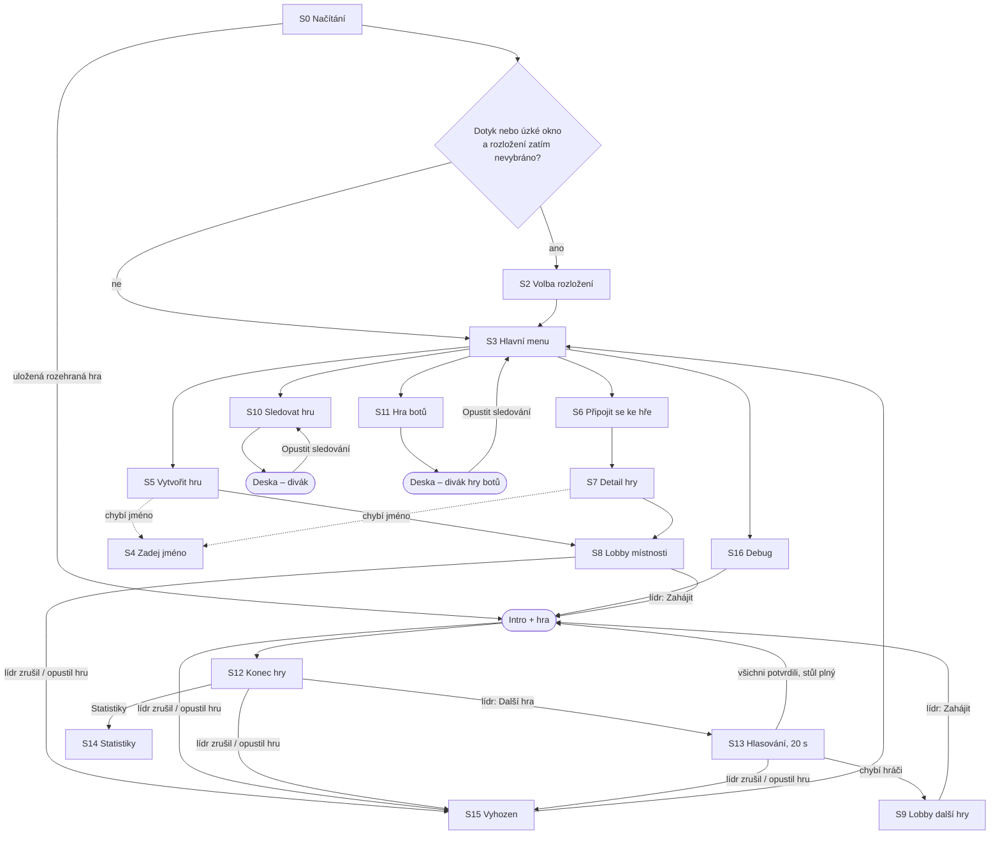

# Bang! online — podklady pro redesign UI mimo hru

**Pro:** Claude Design · **Stav kódu:** 14. 9. 2026, větev `master`, commit `7f2bd0c`
**Rozsah:** všechno kromě herní desky a intro cinematiky: načítání, volba rozložení, hlavní
menu, zadání jména, zakládání hry, seznamy her, lobby, hra botů, konec hry a hlasování
o další hře, statistiky a systémové hlášky. Na konci je **příloha se skutečným kódem** těchto
obrazovek (vložená doslovně ze zdrojáků).

---

## 0. Pět věcí, které mění, jak s tím naložit

1. **Obrazovky nejsou HTML komponenty.** Menu, lobby i konec hry se kreslí do **Phaser 3
   canvasu** v „immediate mode": při každé změně stavu se celá obrazovka smaže a nakreslí
   znovu z absolutních souřadnic v prostoru 1920×1080. Komponenty k převzetí tedy nejsou.
   Kód v příloze se hodí hlavně na přesné texty, podmínky a stavy, ne na strukturu.
2. **Žádný framework, žádný build, žádné CSS řešení.** Vanilla JS, klasické `<script>`
   tagy se sdíleným globálním scope. Žádný Tailwind, CSS moduly ani styled-components.
   Barvy a font drží objekt `THEME` ve `view/theme.js`. Kousky v DOM (okno se jménem,
   statistiky, banner, chat) mají inline styly.
3. **Žádné účty.** Každý je host: jméno se píše do okna, identita pro návrat do hry je
   náhodný token v `localStorage`.
4. **Žádné URL routy.** Jedna stránka `index.html`. Kterou obrazovku kreslit, určuje stav
   klienta (`App.menuScreen`) a fáze místnosti ze serveru (`roomPhase`).
5. **Jen čeština, bez i18n.** Texty jsou natvrdo v kódu.

Rozhodnutí, které stojí před návrhem: **zůstane nové menu v canvasu, nebo přejde do HTML
nad canvasem?** Viz §7.1.

---

## 1. Mapa obrazovek



| # | Obrazovka | Technika | Kde v kódu |
|---|---|---|---|
| S0 | Načítání | canvas | `preload()` v `game.js` |
| S1 | Otoč telefon | HTML | `index.html` |
| S2 | Volba rozložení | canvas | `renderMenuScreen('ui_choice')` |
| S3 | Hlavní menu | canvas | `renderMenuScreen('main')` |
| S4 | Zadej jméno (modal) | HTML | `showNameInput()` |
| S5 | Vytvořit novou hru | canvas + HTML input | `renderMenuScreen('create')` |
| S6 | Připojit se ke hře (seznam) | canvas | `renderMenuScreen('join_list')` |
| S7 | Detail hry před připojením | canvas | `renderMenuScreen('join_room')` |
| S8 | Lobby místnosti | canvas | `renderLobbyScreen()`, `roomPhase: 'lobby'` |
| S9 | Lobby další hry | canvas | `renderLobbyScreen()`, `roomPhase: 'next_lobby'` |
| S10 | Sledovat probíhající hru (seznam) | canvas | `renderMenuScreen('spectate_list')` |
| S11 | Sledovat hru botů | canvas | `renderMenuScreen('bot_game')` |
| S12 | Konec hry | canvas | `renderWinnerScreen()`, `roomPhase: 'playing'` |
| S13 | Hlasování o další hře | canvas | `renderWinnerScreen()`, `roomPhase: 'finished'` |
| S14 | Statistiky hry (překryv) | HTML | `showStats()` |
| S15 | Vyhozen ze hry | canvas | `renderMenuScreen('kicked')` |
| S16 | Debug (vývojářský) | canvas | `renderMenuScreen('debug')` |
| G1 | Banner nové verze | HTML | `showUpdateBanner()` |
| G2 | Rohové ovládání (FS, rozložení, DEBUG) | canvas | `renderUI()`, `renderMenuScreen()` |
| G3 | Potvrzení „Ukončit hru" | nativní `confirm()` | `renderUI()` |

**Hraniční, mimo rozsah** (patří ke hře, jen do nich vedou šipky): intro cinematika (rozdání
rolí, výběr postavy, u navazující hry „nechám si postavu?"), záložní obrazovka výběru postavy
(`renderCharacterSelectScreen`, jen v debug hře a hře botů, kde se intro přeskakuje),
chat (existuje jen během hry), herní překryvná okna a debug nástroje na desce (Creative mode,
galerie karet).

---

## 2. Obrazovky podrobně

U každé obrazovky: kdy se ukáže, co zobrazuje (včetně názvů polí), akce a kam vedou,
a **mezery dnes**, tedy stavy a informace, které současné UI nepokrývá.

### S0 Načítání

- **Kdy:** od otevření stránky do stažení assetů (přes 100 souborů: karty, postavy, role,
  pozadí, logo).
- **Zobrazuje:** jen text `Načítám… {0–100} %` uprostřed (Arial 34 px, `#e8dcc0`) na hnědé
  výplni plátna `#4a3018`. Logo ani pozadí v tu chvíli ještě nejsou načtené.
- Soubory, které se nestáhly, se zkoušejí znovu. Text přitom zůstává na posledním čísle.
- **Pak:** S2 nebo S3. Když má prohlížeč uloženou rozehranou hru, hráč se vrací rovnou na
  své místo u stolu (§4.1).

### S1 Otoč telefon

- **Kdy:** dotykové zařízení (`pointer: coarse`) na výšku. Čisté HTML nad vším
  (z-index 6000), funguje i během načítání.
- **Zobrazuje:** 📱 (animace otočení), nadpis „Otoč telefon na šířku", text „Bang! se hraje
  na šířku – na výšku je všechno malé a karty se nevejdou.", odkaz „Hrát i tak".
- **Akce:** „Hrát i tak" výzvu skryje do konce relace (`sessionStorage.bangRotateDismiss`).

### S2 Volba rozložení

- **Kdy:** na startu, když je displej dotykový nebo okno užší než 820 px **a** hráč ještě
  nevybral (`localStorage.bangUiMode`). Parametr `?ui=mobile|desktop` v URL ji přeskočí.
- **Zobrazuje:** logo; nadpis „Jaké rozložení?"; podtitul „Vyber si, jak se má kreslit herní
  stůl. Změnit to jde kdykoli v menu vlevo dole."; dvě karty:
  - **📱 Mobilní rozložení**: „Větší karty, soupeři v jedné řadě nahoře, ruka přes celou
    šířku. Pro telefon a tablet."
  - **🖥 PC rozložení**: „Soupeři v kruhu kolem stolu, menší karty. Pro počítač a velké
    displeje."
  - pod doporučenou (autodetekce): „✓ doporučeno pro tvé zařízení".
- **Akce:** klik na kartu uloží `bangUiMode` = `big` / `normal` a pokračuje na S3.
- Volba mění **jen rozložení herní desky**, menu vypadá v obou režimech stejně.

### S3 Hlavní menu

- **Zobrazuje:** logo (500 px na šířku), pod ním panel se čtyřmi tlačítky. Nezobrazuje
  jméno hráče, počet lidí nebo her online, ani verzi.
- **Akce:**

  | Prvek | Kam vede |
  |---|---|
  | 🎮 Připojit se ke hře | S6 |
  | ✚ Vytvořit novou hru | S5 |
  | 👁 Sledovat probíhající hru | S10 |
  | 🤖 Sledovat hru botů | S11 |
  | čip vlevo dole „📱 Mobilní rozložení" / „🖥 PC rozložení" | přepne rozložení na místě (na S2 nevede) |
  | čip vpravo dole „⚙ DEBUG" | S16 |
  | čip vpravo nahoře „⛶ FS" (na všech obrazovkách, dokud není fullscreen) | fullscreen, na Androidu i zámek na šířku |

### S4 Zadej jméno (modal)

- **Kdy:** při vstupu na S5 nebo S7, pokud hráč v téhle relaci jméno ještě nezadal. Jinde se
  na jméno neptá: sledování ani hra botů ho nepotřebují.
- **Pole:** input (max 18 znaků, placeholder „Tvoje jméno"), řádek pro chybu, tlačítko **OK**
  (potvrzuje i Enter).
- **Validace** živě při psaní. Klient si při každé změně vyžádá seznam obsazených jmen
  (`taken_names` = jména všech připojených hráčů na serveru):
  - prázdné: „Jméno nesmí být prázdné."
  - obsazené: `Jméno "X" je již obsazeno.`
- **OK** uloží jméno jen do paměti stránky a obrazovka pod oknem se překreslí.
- **Mezery dnes:** okno nejde zavřít (chybí Zrušit a po „◀ Zpět" zůstane viset nad menu);
  jméno se po obnovení stránky zapomene (kromě návratu do rozehrané hry); v menu jméno
  změnit nejde, jediné „ZMĚNIT JMÉNO" je na S7 při kolizi.

### S5 Vytvořit novou hru

- **Horní lišta:** „◀ Zpět" (na S3), nadpis „Vytvořit novou hru".
- **Bez jména:** text „Zadej nejdříve své jméno:" a okno S4.
- **Formulář** shora dolů:

  | Prvek | Typ | Výchozí hodnota | Pravidla |
  |---|---|---|---|
  | „Hráč: {jméno}" | text | – | jen informace |
  | Název hry | textové pole (HTML input napozicovaný nad canvas) | `Hra hráče {jméno}` | nesmí být prázdné; délka se neomezuje (ani na serveru) |
  | Rozšíření | 5 zaškrtávátek s nápovědou | vše vypnuté | §3.2 |
  | Počet hráčů | 6 dlaždic 3 · 4 · 5 · 6 · 7 · 8 | **nevybráno** | povinné |
  | nápověda pro 3 hráče | text | – | „Město duchů: bez šerifa, role lícem nahoru, cíle v kruhu." |
  | ▼ Pokročilé možnosti ▼ | rozbalovač | sbalený | §3.3 |
  | VYTVOŘIT HRU | tlačítko | šedé (neaktivní) | aktivní až po výběru počtu hráčů a s neprázdným názvem |
  | ⚙ DEBUG | čip vpravo dole | – | S16 |

- **VYTVOŘIT HRU** odešle `create_room`, hráč skončí rovnou v S8 jako lídr a formulář se
  vynuluje.
- Zaškrtnutí rozšíření hned na pozadí začne stahovat jeho grafiku; v UI se to neukazuje.

### S6 Připojit se ke hře

- **Horní lišta:** „◀ Zpět" (na S3), nadpis „Připojit se ke hře".
- **Seznam** místností, které čekají na hráče (fáze `lobby` i `next_lobby`). Aktualizuje se
  **živě**: server pošle nový seznam všem připojeným při každé změně kterékoli místnosti.
- **Řádek:** `name` vlevo, `{playerCount} / {maxPlayers} hráčů` vpravo. Klik vede na S7.
- **Data položky:** `{ id, name, maxPlayers, playerCount, players: string[] }`.
- **Prázdný seznam:** „Žádné hry nečekají na hráče."
- **Mezery dnes:** plná místnost vypadá stejně jako volná (chyba přijde až po kliknutí na
  Připojit); není vidět, jaká rozšíření místnost hraje, kdo je lídr, ani že jde o navazující
  hru; seznam neroluje, takže zhruba od 10 místností přeteče mimo obrazovku.

### S7 Detail hry před připojením

- **Horní lišta:** „◀ Zpět" (na S6), nadpis = název hry, podtitul `{playerCount} / {maxPlayers} hráčů`.
- **Seznam** jmen v místnosti (vlastní jméno zvýrazněné s „(ty)"), prázdná místa jako
  „{n}. — čeká se…".
- **Bez jména:** „Zadej své jméno:" a okno S4.
- **Se jménem:**
  - volné jméno: tlačítko **„PŘIPOJIT SE (jako {jméno})"** odešle `join_room` a vede do S8;
  - kolize s někým v místnosti nebo na serveru: červeně `Jméno "X" je již v místnosti
    obsazeno.` a místo připojení tlačítko **„ZMĚNIT JMÉNO"** (smaže jméno a otevře S4).
- **Chyby ze serveru** (`join_error`, zobrazí se jednou červeně nad tlačítkem):
  - „Hra není dostupná" (mezitím začala nebo zanikla)
  - „Hra je plná"
  - `Hráč se jménem "X" již v místnosti hraje`
  - `Jméno "X" je již používáno jiným hráčem na serveru`
- **Mezera dnes:** údaje jsou snímek z okamžiku kliknutí v S6 a na S7 se neaktualizují.

### S8 Lobby místnosti (`roomPhase: 'lobby'`)

- **Kdo tu je:** lídr (zakladatel) a připojení hráči. Diváci sem nechodí.
- **Zobrazuje:**
  - „◀ Opustit hru" vlevo nahoře (červené), vidí všichni;
  - nadpis `roomName`, podtitul `{players.length} / {maxPlayers} hráčů`;
  - řádek za každého hráče v pořadí připojení: „👑 " u lídra, jméno, „(ty)" u sebe;
    boti se jmenují `🤖 Bot N`;
  - prázdná místa: lídr vidí klikací „➕ Přidat bota", ostatní „{n}. — čeká se…";
  - u řádku bota vidí lídr vpravo „✕" (odebrat).
- **Akce lídra:**

  | Prvek | Událost | Výsledek |
  |---|---|---|
  | ➕ Přidat bota | `add_bot` | bot obsadí místo |
  | ✕ u bota | `remove_bot` | bot zmizí |
  | ZRUŠIT HRU | `cancel_game` | místnost zanikne; lídr jde na S3, ostatní na S15 („Game leader ukončil hru.") |
  | ZAHÁJIT HRU | `start_game` | intro cinematika a hra |

  - ZAHÁJIT HRU je aktivní **jen při plném stole** (`players.length === maxPlayers`). Po
    kliknutí se změní na „ZAHAJUJI…" a zamkne.
  - Se zapnutým rozšířením se před startem čeká (max. 12 s), až mají všichni stáhnutou jeho
    grafiku. Mezitím svítí „⏳ Načítám karty rozšíření u všech hráčů…".
  - Pořadí u stolu se losuje až při startu; lídr zůstává první.
- **Ostatní hráči:** místo tlačítek text „Čeká se na Game Leadera…".
- **Data** (`room_update`, posílá se každému zvlášť):

  ```
  roomId, roomName, roomPhase, leaderSocketId, maxPlayers, myIndex,
  players: [{ socketId, playerIdx, name, isBot?, disconnected?, wantsNext,
              ready, wasOriginalSurvivor, token }],
  options: { … viz §3 },
  assetsWaiting: boolean,
  gameState: { … }   // v lobby prázdný, plní se až startem
  ```

  Kdo je „já": `players[i].socketId === socket.id`. Kdo je lídr: `leaderSocketId`.
- **Mezery dnes:**
  - lobby **neukazuje nastavení místnosti** (rozšíření ani pokročilé volby, zná je jen zakladatel);
  - počet hráčů po založení změnit nejde;
  - chybí chat (existuje jen ve hře) a nejde vyhodit lidského hráče;
  - pole `ready` ve stavu je, ale nic ho nepoužívá;
  - když lídr z lobby odejde, lídrem se stane první v seznamu, i kdyby to byl bot.

### S9 Lobby další hry (`roomPhase: 'next_lobby'`)

- Stejná obrazovka jako S8. Otevře se, když po konci hry chybí hráči (S13).
- U jmen se kreslí značka ✅ / ❌ / … podle `wantsNext`. Při otevření se ale hlasy nulují,
  takže v praxi svítí „…" u všech.
- Místnost je znovu v seznamu S6 a noví hráči se mohou připojit.
- **Lídr:** ZRUŠIT HRU a ZAHÁJIT HRU (`check_start_next`, taky jen při plném stole). Start vede
  do intra navazující hry, kde se přeživší rozhodují, jestli si nechají postavu.
- **Ostatní:** „Čeká se na doplnění hráčů a Game Leadera…".

### S10 Sledovat probíhající hru

- **Horní lišta:** „◀ Zpět" (na S3), nadpis „Sledovat probíhající hru".
- **Seznam** běžících her (fáze `char_select` nebo `playing`, dosud bez vítěze), včetně her
  botů („🤖 Hra botů") a debug her („DEBUG").
- **Řádek:** `name` vlevo, `{playerCount} hráčů` vpravo. Klik (`spectate`) otevře desku
  v roli diváka. Divák vidí jen veřejné informace (ve hře botů všechno) a vlevo nahoře má
  „◀ Opustit sledování", které vede zpět sem.
- **Data položky:** stejná jako v S6.
- **Prázdný seznam:** „Žádná hra právě neprobíhá."
- **Mezery dnes:** seznam se načte při vstupu na obrazovku a pak se **neaktualizuje**;
  neroluje; divák do hry přisednout nemůže.

### S11 Sledovat hru botů

- **Horní lišta:** „◀ Zpět" (na S3), nadpis „🤖 Sledovat hru botů"; text „Spustí hru
  složenou jen z počítačových hráčů, kterou budeš sledovat."
- **Počet botů:** dlaždice 3–8, výchozí 4.
- **Rozšíření:** stejných 5 zaškrtávátek jako S5, k tomu přepínač „+ přibalené karty (Nová
  identita, Želízka)", pokud je zapnutý High Noon a vypnutý Fistful. Pokročilé možnosti tu
  nejsou.
- **„▶ SPUSTIT A SLEDOVAT"** (`create_bot_game`): hra se rozjede hned, bez intra, uživatel je
  divák. Jméno se nevyžaduje.
- „◀ Opustit sledování" hru botů rozpustí a vede na S3.

### S12 Konec hry (`state.winner` je vyplněný, `roomPhase: 'playing'`)

- **Kdy:** hned po vyhodnocení výhry. Deska zmizí, zůstane pozadí.
- **Zobrazuje:** velký nadpis = věta vítěze z `state.winner`:
  - „Zákon vyhrál!", „Bandité vyhráli!", „Odpadlík vyhrál!";
  - ve hře pro 3: „{Role} vyhrál!" (Pomocník / Bandita / Odpadlík);
  - pod kartou události Divoký západ (výhra jednotlivce): „{jméno} vyhrál!".

  Pod nadpisem tlačítko **„📊 STATISTIKY"** (S14).
- Od téhle chvíle jsou ve stavu **veřejné role všech**: `state.players[]` nese `name, role,
  character, health, stats`.
- **Divák:** jen „◀ ZPĚT DO MENU".
- **Lídr:** text „{n} hráč(ů) chce hrát dál" (jen když n > 0), „✕ ZRUŠIT HRU"
  a „▶ DALŠÍ HRA" (`leader_start_next`, vede do S13).
- **Ostatní:** „▶ CHCI DALŠÍ HRU" (`vote_next_game`), po kliknutí „✓ HLASOVÁNO"; „✕ DO MENU".
- **Mezery dnes:** obrazovka sama nevypisuje, kdo měl jakou roli a jak dopadl; ukáže to jen
  tabulka statistik. Hlas z S12 se při přechodu do S13 zahodí, takže se hlasuje dvakrát.

### S13 Hlasování o další hře (`roomPhase: 'finished'`)

- **Start:** lídr klikl „DALŠÍ HRA". Lídr je automaticky ✅, ostatním se hlas vynuluje a běží
  **odpočet 20 s** (`nextGameTimer`, server posílá stav každou sekundu).
- **Zobrazuje:** „Koho uvidíme v další hře?"; seznam hráčů `✅ | … jméno (ty)`; odpočet
  „⏱ Zbývá {N}s na potvrzení" (do 10 s oranžově, do 5 s červeně a bliká).
- **Ostatní hráči:** blikající „✅ CHCI HRÁT DÁL" (`confirm_next_game`), po kliknutí
  „✅ Připojen – čekám na ostatní"; „OPUSTIT HRU".
- **Lídr:** „ZRUŠIT HRU". Dokud nepotvrdili všichni: „Čekám na rozhodnutí hráčů…". Jakmile
  ano:
  - „ZAHÁJIT HRU ▶" (stůl je plný), vede do intra navazující hry;
  - „DOPLNIT HRÁČE" (někdo odešel, `open_next_lobby`), vede do S9.
- **Konec odpočtu:** kdo nepotvrdil, je poslán na S3; ostatní jdou do S9.

### S14 Statistiky hry (překryv v HTML)

- Přes celou obrazovku, tmavé pozadí (92 %), svislé rolování; tabulka se na mobilu posouvá
  vodorovně.
- **Nadpis:** „📊 STATISTIKY HRY", pod ním souhrn „Celkem: Bang!×…, Zásahy×… (x%), Damage×…,
  Líznuto×…, Odhoz×…".
- **Skupiny:** „Zákon (Šerif + Pomocníci)", „Bandité", „Odpadlíci" (ve hře pro 3 po rolích:
  Pomocník / Bandita / Odpadlík), každá se souhrnným řádkem.
- **Sloupce:** Hráč · Role · Postava · Bang! · Trefil (x %) · Udělil · Utrpěl · Líznul ·
  Zahrál · Odhodil · Zbraně · Top karty (3 nejpoužívanější typy ve tvaru `Typ×n`).
- **Data** `player.stats`: `bangsFired, bangsHit, damageDealt, damageTaken, cardsDrawn,
  cardsPlayed, cardsDiscarded, weaponsCycled, cardsUsed { typKarty: počet }`.
- „✕ Zavřít". Statistiky se nikam neukládají.

### S15 Vyhozen ze hry

- **Kdy:** lídr zrušil hru (v lobby, během hry nebo na konci), nebo lídr opustil rozehranou
  hru. Týká se hráčů i diváků.
- **Zobrazuje:** logo, červený panel „⚠️ {zpráva}", tlačítko „◀ Zpět do menu" (na S3).
- **Zprávy:** „Game leader ukončil hru.", „Game leader opustil hru."

### S16 Debug (vývojářský)

Nástroj pro ladění pravidel, ne pro hráče. Obsahuje výběr rolí (+ Šerif / + Pomocník /
+ Bandita / + Odpadlík, ✕ Clear, výpis „Role: …"), 5 přepínačů rozšíření s přibalenými kartami
a start „▶ 2P / 3P / 4P / 5P", kdy jedno okno ovládá všechna místa u stolu. Nízká priorita;
stačí zachovat funkčnost.

### Globální prvky

- **G1 Banner nové verze:** pruh přes celou šířku nahoře „🔄 Vyšla nová verze hry – načti
  stránku znovu (F5)." s tlačítkem „Načíst znovu". Objeví se kdekoli včetně hry, když se po
  znovupřipojení ukáže, že se na serveru změnil kód.
- **G2 Rohové ovládání:** „⛶ FS" vpravo nahoře na všech obrazovkách, dokud není fullscreen.
  Na dotykovém displeji jsou čipy větší.
- **G3 Ukončit hru:** během hry má lídr vlevo nahoře „✕ Ukončit hru" s nativním
  `confirm('Opravdu chceš ukončit hru? Všichni hráči se vrátí do menu.')`.
- **Pozadí:** `assets/background.webp` přes celé jeviště a přes něj tmavý závoj 55 %
  v menu, lobby i na konci hry (u herního stolu bez závoje).

---

## 3. Nastavení hry

### 3.1 Počet hráčů

3–8. Server ořízne cokoli mimo rozsah, nečíselnou hodnotu nahradí 4. Počet je **pevný od
založení místnosti** a hra startuje **jen s plným stolem**; doplnit ho jde boty.

| Hráčů | Role | Zvláštnost |
|---|---|---|
| 3 | Pomocník, Bandita, Odpadlík | bez šerifa, role lícem nahoru, každý loví určeného soupeře („Město duchů") |
| 4 | Šerif, 2× Bandita, Odpadlík | |
| 5 | Šerif, Pomocník, 2× Bandita, Odpadlík | |
| 6 | Šerif, Pomocník, 3× Bandita, Odpadlík | |
| 7 | Šerif, 2× Pomocník, 3× Bandita, Odpadlík | |
| 8 | Šerif, 2× Pomocník, 3× Bandita, 2× Odpadlík | jediný počet se dvěma odpadlíky |

Debug hra umí navíc 2 hráče.

### 3.2 Rozšíření (`options.expansions`)

**Všechna rozšíření jdou kombinovat libovolně mezi sebou i s jakýmkoli počtem hráčů 3–8.**
Žádné nemá vlastní minimum ani maximum hráčů a server hraje zátěžové hry botů ve všech
kombinacích.

| Klíč | Popisek v UI | Nápověda v UI dnes | Co do hry přidá | Stav |
|---|---|---|---|---|
| `dodge_city` | Dodge City | (+40 karet a +15 postav; karty se symbolem býka) | 40 hracích karet, 15 postav | hotové |
| `high_noon` | High Noon | (13 karet událostí; šerif odkrývá jednu na začátku kola) | balíček událostí | hotové |
| `fistful` | Fistful | (15 karet událostí a 3 postavy; hraje se i vedle High Noonu) | druhý balíček událostí, 3 postavy | hotové |
| `divoky_zapad` | Divoký západ | (10 karet událostí; otáčí je Dostavník a Wells Fargo) | třetí balíček událostí, 8 postav | hotové; nápověda postavy nezmiňuje |
| `zlata_horecka` | Zlatá horečka | (zlaté valouny za zranění; obchod s 24 kartami vybavení) | měna, obchod, karty vybavení | rozpracované (fáze 2 z 8), chybí art |

Anglické názvy originálů: A Fistful of Cards, Wild West Show, Gold Rush. Základní hra má
16 postav.

### 3.3 Pokročilé možnosti

| Klíč | Popisek | Nápověda v UI | Kdy je vidět | Poznámka |
|---|---|---|---|---|
| `noAdvancedCards` | Zakázat pokročilé karty | (bez Duelu, Hokynářství, Indiánů, Vězení, Dynamitu) | vždy | |
| `singleChar` | Přiřadit postavu náhodně | (hráči si nevybírají ze dvou postav) | vždy | přeskočí celou intro cinematiku |
| `rotatingSheriff` | Rotující šerif | (šerif se po každé hře posouvá doleva) | vždy | projeví se až v navazujících hrách |
| `highNoonExtra` | High Noon: přibalené karty | (+ Nová identita a Želízka z Fistfulu) | jen se zapnutým High Noonem a vypnutým Fistfulem | s Fistfulem jsou ty karty ve hře automaticky; při zapnutí High Noonu se dnes samo zaškrtne (dočasné, kvůli testování) |

**Jediná závislost mezi volbami** je u `highNoonExtra`. Hra botů (S11) nabízí jen rozšíření
a `highNoonExtra`.

### 3.4 Co přesně odchází na server

```js
// create_room (S5)
{
  name: "Hra hráče Honza",
  maxPlayers: 5,                       // 3–8
  playerName: "Honza",
  token: "<uuid z localStorage>",
  options: {
    noAdvancedCards: false, singleChar: false, rotatingSheriff: false, highNoonExtra: false,
    expansions: { dodge_city: false, high_noon: true, fistful: false,
                  divoky_zapad: false, zlata_horecka: false }
  }
}

// create_bot_game (S11) – server k options doplní botGame: true
{ count: 4, options: { expansions: { … }, highNoonExtra: false } }
```

---

## 4. Stavy a chyby

### 4.1 Odpojení a návrat

| Situace | Co se děje | Co vidí uživatel dnes |
|---|---|---|
| Vypadne spojení klienta | Socket.IO se připojuje znovu sám; po připojení klient pošle `rejoin`, pokud má uloženou rozehranou místnost | **nic**, indikátor offline ani „připojuji…" neexistuje |
| Hráč se odpojí v lobby | server ho z místnosti odebere, jako by odešel; odchází-li lídr, lídrem se stane první v pořadí | ostatním zmizí ze seznamu |
| Hráč se odpojí během hry | místo zůstává a hraje za něj bot, dokud se nevrátí | ostatní nic nepoznají, žádná značka u hráče |
| Návrat po F5 nebo výpadku | `localStorage.bangSession` + token vrátí hráče na jeho místo | rovnou deska, menu se přeskočí |
| Návrat se nepovede | 6 pokusů po 0,5 s, pak se uložená relace smaže | hlavní menu, bez hlášky |
| Lídr opustí rozehranou hru nebo hlasování | hra končí pro všechny | S15 „Game leader opustil hru." |
| Lídrovi jen vypadne spojení během hry | hraje za něj bot, hra běží dál | nic |
| Lídr zruší hru | místnost zanikne | lídr S3, ostatní S15 „Game leader ukončil hru." |
| Poslední hráč opustí lobby | místnost zanikne | zmizí ze seznamu S6 |
| Divák opustí hru botů | hra se rozpustí | S3 |
| Na server se nahrála nová verze | – | banner G1 |

### 4.2 Plný stůl, kolize, neplatné akce

- Plná místnost vypadá v S6 stejně jako volná; „Hra je plná" přijde až na S7 po kliknutí.
- Hra mezitím začala nebo zanikla: „Hra není dostupná" (S7).
- Obsazené jméno: validace v S4, na S7 chyba a tlačítko „ZMĚNIT JMÉNO".
- Neplatné akce (založit hru, když už hráč v místnosti je; nelídr pošle Zahájit…) server
  **tiše zahodí**, klient nedostane odpověď.
- Obecná chybová obrazovka neexistuje. Server umí poslat událost `notify`, klient ji ale
  nikde nezobrazuje.

### 4.3 Prázdno a čekání

| Kde | Stav | Text dnes |
|---|---|---|
| S0 | stahování assetů | „Načítám… N %" |
| S6 | žádná místnost nečeká | „Žádné hry nečekají na hráče." |
| S10 | žádná hra neběží | „Žádná hra právě neprobíhá." |
| S7, S8 | prázdné místo u stolu | „{n}. — čeká se…" |
| S8 | nelídr čeká na start | „Čeká se na Game Leadera…" |
| S8 | stahuje se grafika rozšíření | „⏳ Načítám karty rozšíření u všech hráčů…" a tlačítko „ZAHAJUJI…" |
| S9 | nelídr čeká | „Čeká se na doplnění hráčů a Game Leadera…" |
| S13 | lídr, ne všichni potvrdili | „Čekám na rozhodnutí hráčů…" |
| S13 | hráč potvrdil | „✅ Připojen – čekám na ostatní" |

### 4.4 Přetečení, velikosti, mobil

- Seznamy v S6 a S10 nerolují. Lobby pro 8 hráčů zabere skoro celou výšku.
- **Jeviště:** návrhová plocha 1920×1080. Na displeji s jiným poměrem stran se plocha
  rozšíří do stran (strop 2560×1440), obsah menu zůstává uprostřed ve stejném měřítku
  a rohové prvky se lepí na skutečné okraje. Celé plátno se pak škáluje do okna (FIT).
- **Mobil:** hraje se jen na šířku (jinak S1). Telefon na šířku znamená měřítko kolem 0,36,
  takže 26px text v návrhu je na displeji asi 9 CSS px (proto jsou rohové čipy na dotyku
  zvětšené). Textová pole mají aspoň 16 px, jinak iOS při zaměření zoomuje. Okno se jménem
  se pod vysunutou klávesnicí dá rolovat.
- Na desktopu má plátno zlatý rám 3 px se zaoblením 12 px; na mobilu rám není.

---

## 5. Účty a identita

- **Přihlášení, registrace, hesla, profil, avatar ani trvalé statistiky neexistují** a v repu
  (docs/, seznam bugů) nejsou plánované.
- Každý je **host**. Identitu tvoří:

  | Co | Kde je uložené | Jak dlouho platí |
  |---|---|---|
  | jméno | paměť stránky; během hry i `localStorage.bangSession.name` | mimo hru do obnovení stránky |
  | `bangToken` (UUID) | `localStorage` | trvale v daném prohlížeči; slouží jen k návratu na místo po výpadku |
  | `bangSession` `{ roomId, name }` | `localStorage` | od vstupu do místnosti do záměrného odchodu |

- **Unikátnost jména** se hlídá mezi aktuálně připojenými hráči na serveru, ne trvale.
- **Statistiky** jsou jen za jednu hru (S14); žádná historie ani žebříček.
- **Uložené preference:** `bangUiMode` (localStorage), `bangRotateDismiss` a `bangFsOffered`
  (sessionStorage).
- **Pozor pro případné účty:** `room_update` dnes posílá každému klientovi celé pole
  `players` **včetně tokenů ostatních hráčů**. Kdo token zná, může se vrátit na cizí odpojené
  místo. Než se na identitu cokoli postaví, musí se to zavřít na serveru.

---

## 6. Kontrakt se serverem (Socket.IO)

### Klient → server (mimo herní akce)

| Událost | Payload | Kdo smí | Odpověď |
|---|---|---|---|
| `create_room` | viz §3.4 | kdo není v místnosti | `room_joined { roomId, myIndex }` + `room_update`; všem `lobby_list` |
| `join_room` | `{ roomId, playerName, token }` | kdokoli | `room_joined` + `room_update`, nebo `join_error` (text) |
| `get_taken_names` | – | kdokoli | `taken_names: string[]` |
| `leave_room` | – | hráč v místnosti | `go_to_menu` |
| `add_bot` / `remove_bot` | – / `{ socketId }` | lídr v lobby | `room_update` |
| `start_game` | – | lídr, plný stůl | `room_update` (`roomPhase: 'char_select'`) + intro |
| `cancel_game` | – | lídr | lídr `go_to_menu`, ostatní `kicked_from_game` |
| `get_game_list` | – | kdokoli | `game_list` |
| `spectate` | `{ roomId }` | kdokoli | `room_update` s `myIndex: null` |
| `leave_spectate` | – | divák | `spectate_left` (u hry botů `go_to_menu`) |
| `create_bot_game` | viz §3.4 | kdo není v místnosti | `room_update` s `myIndex: null` |
| `vote_next_game` | `true` | hráč po konci hry | `room_update` |
| `leader_start_next` | – | lídr po konci hry | `room_update` každou sekundu (odpočet) |
| `confirm_next_game` | – | hráč ve fázi `finished` | `room_update` |
| `check_start_next` | – | lídr | start navazující hry |
| `open_next_lobby` | – | lídr | `room_update` (`roomPhase: 'next_lobby'`); všem `lobby_list` |
| `go_to_menu` | – | kdokoli | `go_to_menu` |
| `rejoin` | `{ roomId, token }` | kdokoli | `room_joined` + `room_update`, nebo `rejoin_failed` |
| `debug_start` | `{ playerCount, roles, dodgeCity, highNoon, highNoonExtra, fistful, divokyZapad, zlataHorecka }` | kdokoli | debug hra |

Klient posílá i `get_lobby_list`, server na něj ale handler nemá. Seznam se drží z push
zpráv `lobby_list`, takže to nevadí.

### Server → klient

`server_version` (po připojení), `lobby_list` (po připojení a při každé změně libovolné
místnosti), `game_list` (po připojení a na vyžádání), `room_joined`, `room_update`,
`join_error`, `taken_names`, `go_to_menu`, `kicked_from_game`, `spectate_left`,
`rejoin_failed`, `notify` (klient nezobrazuje), `chat_message` (jen ve hře).

### Fáze místnosti

```
lobby ──start_game──► char_select ──► playing ──(výhra, fáze zůstává)──► finished
                                                                          │
                            char_select ◄──check_start_next───────────────┤
                            char_select ◄──check_start_next── next_lobby ◄┘
```

---

## 7. Technický rámec

### 7.1 Otevřené rozhodnutí: canvas, nebo HTML?

Dnes je celé menu v Phaseru. V praxi to znamená:

- každý prvek má absolutní souřadnice; žádný flexbox, grid ani CSS stavy, hover se řeší
  kódem ručně;
- textová pole jsou HTML inputy ručně napozicované nad canvas a přepočítávané při změně
  velikosti okna;
- nic neroluje;
- každá vizuální změna je změna kódu po jednotlivých prvcích.

Menu a lobby sdílejí s herní deskou jen pozadí a font. Klientský router je kreslí
v samostatné větvi (`renderUI` → `renderMenuScreen` / `renderLobbyScreen`) a HTML vrstvy nad
canvasem už existují (okno se jménem, statistiky, banner, chat). Přechod menu do HTML/CSS
je proto proveditelný bez zásahu do hry. Pokud má menu zůstat v canvasu, drž návrh
u tvarů, které Phaser kreslí levně: zaoblené obdélníky, text, obrázky a emoji jako ikony.
**Rozhodnutí je na zadavateli.**

### 7.2 Stack

| Vrstva | Dnes |
|---|---|
| Klient | vanilla JS, bez bundleru; pořadí `<script>` v `index.html` je závazné |
| Render | Phaser 3.60 z CDN (jsDelivr) |
| Styl | tokeny `THEME` a helpery `themeButton` / `themePanel` / `themeTitle` / `themeToggleStyle` ve `view/theme.js`; HTML kousky mají inline styly; jediné `<style>` bloky jsou v `index.html` (rám plátna, S1) a v `chat.js` |
| Font | Oswald 400 / 500 / 600 / 700 z Google Fonts, fallback Trebuchet MS |
| Ikony | emoji v textu (🎮 ✚ 👁 🤖 ◀ ▶ ✕ ✅ ❌ 👑 ➕ ⏳ 📊 ⏱ 🔄 ⚙ ⛶ 📱 🖥); ikonová sada žádná |
| Server | Node ≥ 20, Express 5, Socket.IO 4.8; statické soubory z kořene repa |
| Assety | výhradně WebP (PNG se nepřidávají); `assets/logo.webp` 2000×1090, `assets/background.webp` 4K |
| Testy | `node --test` pro pravidla a server; UI se ověřuje ručně v prohlížeči |

### 7.3 Vizuální tokeny (`view/theme.js`)

| Token | Hodnota | Použití |
|---|---|---|
| `bg` | `#141118` | celkové pozadí |
| `panel` | `#1e1a24` | panely, tlačítka |
| `panelHi` | `#2a2431` | hover |
| `border` | `#3a3242` | tlumený okraj |
| `gold` | `#e0b23c` | akcent, nadpisy, aktivní přepínač |
| `goldDark` | `#8a6d1f` | rámy tlačítek, rám plátna |
| `text` | `#f2ede4` | primární text |
| `textMuted` | `#9a9088` | vedlejší text |
| `danger` / `dangerDark` | `#d64545` / `#7a2424` | zrušit, opustit, chyby |
| `success` / `successDark` | `#5fae5f` / `#2f5f2f` | vytvořit, zahájit, potvrdit |
| role | Šerif `#e0b23c`, Pomocník `#2f7fb8`, Bandita `#c0392b`, Odpadlík `#8e44ad` | |
| `radius` | 14 (tlačítka), 18 (panely), 12 (nadpisový pruh, řádky seznamů) | |

- **Tlačítko:** stín 2/4 px s 35 % černé, rám 2 px `goldDark`. Hover = výplň `panelHi`, rám
  `gold`, zvětšení na 1,03. Aktivuje se na `pointerup`. Aktivní přepínač má výplň `#4a3a12`,
  rám a text `gold`.
- **Nadpis:** zlatý text 46 px na černém pruhu (55 %) se zlatým rámem.
- **Mimo tokeny, natvrdo:** tlačítka hlavního menu mají každé vlastní tmavou výplň (zelená
  `#1a3326`, hnědá `#33261a`, modrá `#1a2033`, fialová `#2a1a33`); dlaždice počtu hráčů
  a zaškrtávátka `#333333` / `#666666`; nápovědy `#666`, popisky `#aaa`; výběr/aktivní stav
  `#4a3a12`.

---

## 8. Co je plánované nebo rozpracované

- **Nové obrazovky ani účty** v repu naplánované nejsou (prošel jsem `docs/` i seznam bugů).
  Plánované je to, na čem se domluvíte v redesignu.
- **Zlatá horečka** je rozpracovaná (fáze 3–8 z 8): přibude 8 postav a zbylé druhy vybavení.
  Popisek jejího zaškrtávátka se nejspíš změní; nové volby do zakládání hry nepřidává.
- **Automatické zaškrtnutí přibalených karet** při zapnutí High Noonu je dočasné.
- **Refaktor klienta** (rozklad `game.js` do `view/*`) se menu dotýká jen tím, že jeho kód už
  leží ve `view/menu.js`.

---

## Příloha A — kód obrazovek

Doslovně ze zdrojáků ke commitu `7f2bd0c`. Vynechané je jen to, co s menu nesouvisí
(Creative mode v `view/menu.js` a zbytek `game.js` / `net/handlers.js`).

Globály, na které kód sahá: `gameScene` (Phaser scéna), `App` (UI stav, `state.js`),
`roomState` (poslední `room_update`), `state` (= `roomState.gameState`), `socket`,
`playerName`, `myIndex`, `bangToken`; `stageLeft/Right/Top/Bottom()` vrací okraje jeviště
v návrhových px.

### A.1 Vizuální tokeny a helpery

`view/theme.js`, řádky 1–134

```js
// view/theme.js — JEDINÝ zdroj pravdy pro vzhled UI (paleta, font, kreslicí helpery).
// Klientský global (žádný build step): načítá se v index.html PŘED game.js.
// Styl: „hybrid" – tmavý podklad + westernové zlaté akcenty, zaoblená tlačítka.
//
// Helpery kreslí do Phaser scény a přidávají výsledek do scene.cardsSprites
// (immediate-mode: renderUI vše smaže a překreslí, viz game.js).

const THEME = {
    // Font: veškerý český text. Oswald z Google Fonts, s bezpečnými fallbacky.
    fontUI: "'Oswald', 'Trebuchet MS', sans-serif",

    color: {
        bg:        '#141118', bgNum:        0x141118,   // celkové pozadí
        panel:     '#1e1a24', panelNum:     0x1e1a24,   // panely / tlačítka
        panelHi:   '#2a2431', panelHiNum:   0x2a2431,   // hover / světlejší
        border:    '#3a3242', borderNum:    0x3a3242,   // tlumený okraj
        gold:      '#e0b23c', goldNum:      0xe0b23c,   // zlatý akcent
        goldDark:  '#8a6d1f', goldDarkNum:  0x8a6d1f,   // tmavší zlatá (rámy)
        text:      '#f2ede4',                            // primární text
        textMuted: '#9a9088',                            // tlumený text
        danger:    '#d64545', dangerNum:    0xd64545,   // červená (BANG!/nebezpečí)
        dangerDark:'#7a2424', dangerDarkNum:0x7a2424,
        success:   '#5fae5f', successNum:   0x5fae5f,   // zelená (úspěch/přijmout)
        successDark:'#2f5f2f', successDarkNum:0x2f5f2f,
    },

    // Barvy rolí (sjednoceno z view/menu.js roleColors).
    role: { Sheriff: 0xe0b23c, Deputy: 0x2f7fb8, Outlaw: 0xc0392b, Renegade: 0x8e44ad },

    radius: 14,
};

// Vykreslí tělo tlačítka (stín + výplň + zlatý rám) do daného Graphics, se středem v (0,0).
function _themeDrawBody(gfx, w, h, fill, stroke, r) {
    gfx.clear();
    gfx.fillStyle(0x000000, 0.35);
    gfx.fillRoundedRect(-w / 2 + 2, -h / 2 + 4, w, h, r);   // vržený stín
    gfx.fillStyle(fill, 1);
    gfx.fillRoundedRect(-w / 2, -h / 2, w, h, r);            // tělo
    gfx.lineStyle(2, stroke, 0.95);
    gfx.strokeRoundedRect(-w / 2, -h / 2, w, h, r);          // rám
}

// Zaoblené tlačítko. Střed v (x,y); s opts.origin=[ox,oy] lze zarovnat jako u setOrigin
// (např. [0,0] = (x,y) je levý horní roh – pro rohové chipy). Vrací { bg, txt } – `bg` je
// interaktivní kontejner (podporuje .on('pointerup', …)) kvůli kompatibilitě se staršími call-site.
// Klik je vázán na `pointerup` (ne pointerdown): immediate-mode renderUI často překreslí celé
// UI (broadcast serveru, 1s odpočet další hry, tahy botů) a tlačítko mezitím zničí a znovu
// vytvoří; pointerup se chytí i na nově vytvořeném tlačítku, když se re-render trefí mezi
// stisk a puštění – jinak by kliky „propadávaly" a tlačítka šla těžko zmáčknout.
// opts: { onClick, fill, fillHover, stroke, textColor, fontSize, fontStyle, radius, origin }
function themeButton(scene, x, y, w, h, label, opts = {}) {
    const fill      = opts.fill      ?? THEME.color.panelNum;
    const fillHover = opts.fillHover ?? THEME.color.panelHiNum;
    const stroke    = opts.stroke    ?? THEME.color.goldDarkNum;
    const textColor = opts.textColor ?? THEME.color.text;
    const fontSize  = opts.fontSize  ?? '24px';
    const fontStyle = opts.fontStyle ?? 'bold';
    const r         = opts.radius    ?? THEME.radius;
    const [ox, oy]  = opts.origin    ?? [0.5, 0.5];

    const cont = scene.add.container(x + w * (0.5 - ox), y + h * (0.5 - oy));
    const gfx = scene.add.graphics();
    _themeDrawBody(gfx, w, h, fill, stroke, r);
    const txt = scene.add.text(0, 0, label, {
        fontFamily: THEME.fontUI, fontSize, color: textColor, fontStyle, align: 'center',
        shadow: { offsetX: 0, offsetY: 1, color: '#000', blur: 3, fill: true },
    }).setOrigin(0.5);
    cont.add([gfx, txt]);
    cont.setSize(w, h);
    // Hit-area jako TOP-LEFT obdélník (0,0,w,h), NE vycentrovaný (-w/2,-h/2,…):
    // Phaser 3.60 při hit-testu normalizuje bod o displayOrigin (w/2,h/2), takže
    // vycentrovaný obdélník posune klikací zónu o půl šířky doleva (a půl výšky nahoru).
    // Top-left obdélník tuto normalizaci vyruší → hitbox přesně sedí na tlačítku.
    cont.setInteractive(new Phaser.Geom.Rectangle(0, 0, w, h), Phaser.Geom.Rectangle.Contains);
    cont.input.cursor = 'pointer';

    cont.on('pointerover', () => { _themeDrawBody(gfx, w, h, fillHover, THEME.color.goldNum, r); cont.setScale(1.03); });
    cont.on('pointerout',  () => { _themeDrawBody(gfx, w, h, fill, stroke, r); cont.setScale(1); });
    if (opts.onClick) cont.on('pointerup', opts.onClick);

    scene.cardsSprites.add(cont);
    return { bg: cont, txt };
}

// Styl pro přepínací tlačítko (aktivní/„armed" = zlaté, jinak neutrální panel).
// Vrací část opts pro themeButton: { fill, fillHover, stroke, textColor }.
function themeToggleStyle(active) {
    return active
        ? { fill: 0x4a3a12, fillHover: 0x5c4915, stroke: THEME.color.goldNum, textColor: THEME.color.gold }
        : { fill: THEME.color.panelNum, fillHover: THEME.color.panelHiNum, stroke: THEME.color.goldDarkNum, textColor: THEME.color.text };
}

// Zaoblený panel (podklad pro seskupení tlačítek/formulářů), střed v (x,y).
function themePanel(scene, x, y, w, h, opts = {}) {
    const fill   = opts.fill   ?? THEME.color.panelNum;
    const stroke = opts.stroke ?? THEME.color.borderNum;
    const alpha  = opts.alpha  ?? 0.92;
    const r      = opts.radius ?? 18;
    const g = scene.add.graphics();
    g.fillStyle(0x000000, 0.30);
    g.fillRoundedRect(x - w / 2 + 2, y - h / 2 + 5, w, h, r);
    g.fillStyle(fill, alpha);
    g.fillRoundedRect(x - w / 2, y - h / 2, w, h, r);
    g.lineStyle(2, stroke, 0.9);
    g.strokeRoundedRect(x - w / 2, y - h / 2, w, h, r);
    scene.cardsSprites.add(g);
    return g;
}

// Jednotný nadpis / název hry (zlatý text na tmavém zaobleném pruhu), střed v (x,y).
// Nahrazuje roztroušené inline `48px #ffcc00 …` titulky.
function themeTitle(scene, x, y, text, opts = {}) {
    const fontSize  = opts.fontSize  ?? '46px';
    const textColor = opts.textColor ?? THEME.color.gold;
    const txt = scene.add.text(x, y, text, {
        fontFamily: THEME.fontUI, fontSize, color: textColor, fontStyle: 'bold',
        shadow: { offsetX: 0, offsetY: 2, color: '#000', blur: 4, fill: true },
    }).setOrigin(0.5);
    const w = txt.width + 52, h = txt.height + 20;
    const g = scene.add.graphics();
    g.fillStyle(0x000000, 0.55);
    g.fillRoundedRect(x - w / 2, y - h / 2, w, h, 12);
    g.lineStyle(2, THEME.color.goldDarkNum, 0.85);
    g.strokeRoundedRect(x - w / 2, y - h / 2, w, h, 12);
    scene.children.bringToTop(txt);   // text nad podkladem
    scene.cardsSprites.add(g);
    scene.cardsSprites.add(txt);
    return { txt, bg: g, height: h };
}

if (typeof module !== 'undefined' && module.exports) {
    module.exports = { THEME, themeButton, themePanel, themeTitle, themeToggleStyle };
}
```

### A.2 Router obrazovek (začátek renderUI)

`game.js`, řádky 2795–2934

```js
function renderUI() {
    if (!gameScene) return;

    // Kreslila deska v předchozím renderu? Reflow slide (klouzání karet z minulé pozice)
    // smí navazovat jen na PŘEDCHOZÍ render desky – po intru / výběru postav / menu /
    // vítězné obrazovce jsou uložené pozice z jiné hry a musí se zahodit (viz níž).
    const _boardWasShown = App.boardShown;
    App.boardShown = false;

    const isSpectator = myIndex === null && !!state;

    gameScene.cardsSprites.clear(true, true);
    // POZN.: zoom karty tu ZÁMĚRNĚ nerušíme. renderUI běží i při cizí akci a tvrdý
    // stopCardZoom() by resetoval odpočet/zvýraznění karty pod nehybným kurzorem. Zoom je
    // klíčovaný identitou karty (_zoomKey) a uklízí ho _tickCardZoom() z update() smyčky,
    // jakmile pod kurzorem přestane být karta s daným klíčem (změna obrazovky, zmizení karty).

    // Závoj pozadí jen v menu/lobby/výběru/výsledcích (čitelnost textu). U herního
    // stolu je pozadí klasické bez ztmavení (závoj se úplně vypne).
    {
        const inLobbyOrMenu = !roomState || roomState.roomPhase === 'lobby' || roomState.roomPhase === 'next_lobby';
        const showingBoard = !inLobbyOrMenu && !!state && !state.winner
            && state.phase !== 'MENU' && state.phase !== 'CHARACTER_SELECT'
            && !_introActive() && !App.introExpected;
        if (gameScene.bgScrim) gameScene.bgScrim.setAlpha(showingBoard ? 0 : 0.55);
    }

    showOrHideChat(!!(roomState && state && state.phase !== 'MENU' && state.phase !== 'CHARACTER_SELECT') || _introActive() || !!App.introExpected);

    if (!roomState || (roomState.roomPhase !== 'lobby' && roomState.roomPhase !== 'next_lobby')) {
        cleanupTextInputs?.();
    }

    {
        const isFs = !!document.fullscreenElement;
        if (!isFs) {
            // Na dotykovém displeji je 22px písmo ~8 CSS px – tlačítko nešlo trefit prstem.
            const small = isSmallTouchUi();
            let fsBtn = gameScene.add.text(stageRight() - 20, stageTop() + 20, '⛶ FS',
                { fontFamily: THEME.fontUI, fontSize: small ? '40px' : '22px', color: '#9a9088', backgroundColor: 'rgba(0,0,0,0.55)', padding: small ? { x: 18, y: 12 } : { x: 10, y: 6 } })
                .setOrigin(1, 0).setDepth(1000).setInteractive({ useHandCursor: true });
            fsBtn.on('pointerover', () => fsBtn.setColor('#e0b23c'));
            fsBtn.on('pointerout', () => fsBtn.setColor('#9a9088'));
            fsBtn.on('pointerdown', () => requestGameFullscreen());
            gameScene.cardsSprites.add(fsBtn);
        }
    }

    if (state?.isDebug && state.phase !== "MENU" && state.phase !== "CHARACTER_SELECT" && state.players) {
        // Přepínač hráčů – sjednocený vzhled s herními tlačítky (themeButton + toggle styl).
        // Řada začíná až za rohovým „Ukončit hru" (30..240), ať se nepřekrývají.
        const btnY = stageTop() + 30, btnH = 48, btnW = 104, gap = 8, startX = stageLeft() + 260;
        state.players.forEach((p, i) => {
            const isActive = i === myIndex;
            const bx = startX + i * (btnW + gap);
            const { bg } = themeButton(gameScene, bx, btnY, btnW, btnH,
                `P${i + 1}: ${p.name.replace('Debug', '')}`,
                { origin: [0, 0], ...themeToggleStyle(isActive), fontSize: '15px',
                  onClick: isActive ? undefined : () => {
                      // Deska se otočí na jiné sedadlo – zahoď domovské pozice klouzání,
                      // jinak by každá cizí karta přeletěla přes stůl na své nové místo
                      // (vypadalo to, že karty odlétají i hráči, který je na řadě po mně).
                      App.debugViewAs = i; myIndex = i;
                      if (typeof resetBoardSlides === 'function') resetBoardSlides();
                      renderUI();
                  } });
            bg.setDepth(1000);
        });
    }

    // ── MENU / LOBBY ──────────────────────────────────────────────────────────
    if (!roomState) {
        renderMenuScreen(App.menuScreen || 'main');
        return;
    }

    const rPhase = roomState.roomPhase;
    if (rPhase === 'lobby' || rPhase === 'next_lobby') {
        cleanupTextInputs?.();
        renderLobbyScreen();
        return;
    }

    if (!state) return;
    if (state.phase !== "MENU" && !state.players) return;

    // ── INTRO (mícání, rozdávání rolí/postav/karet) ────────
    if (_introActive() || App.introExpected) {
        if (_introActive()) {
            renderIntroScene();
        } else {
            // Intro brzy dorazi (50ms delay na serveru) - zobraz prazdnou obrazovku
            const cover = stageCoverSize();
            const bg2 = gameScene.textures.exists('background')
                ? gameScene.add.image(960, 540, 'background').setDisplaySize(cover.w, cover.h).setDepth(0)
                : gameScene.add.rectangle(960, 540, stageW(), stageH(), 0x2a1c10).setDepth(0);
            gameScene.cardsSprites.add(bg2);
        }
        return;
    }

    if (App.spectating) {
        // Hra jen botů (jsem její zakladatel = leader): řekni serveru, ať ji
        // rozpustí. Navigaci pak provede echo 'go_to_menu' (→ hlavní menu).
        const { bg: specBack } = themeButton(gameScene, stageLeft() + 30, stageTop() + 30, 260, 52, '◀  Opustit sledování', {
            origin: [0, 0], fill: THEME.color.dangerDarkNum, fillHover: 0x9a3030,
            stroke: THEME.color.dangerNum, fontSize: '20px',
            onClick: () => {
                if (roomState && roomState.leaderSocketId === socket.id) {
                    socket.emit('go_to_menu');
                    return;
                }
                // Server nás musí odhlásit z kanálu diváků, jinak nás další room_update
                // z menu vrátí zpátky do hry. Než ale odhlášení doběhne, můžou být updaty
                // téhle místnosti už na cestě → ignoruj je lokálně (App.ignoreRoomId).
                socket.emit('leave_spectate');
                stopSpectating(roomState?.roomId);
            },
        });
        specBack.setDepth(500);
    }

    // Lídrovské „Ukončit hru" jen pro hrajícího lídra – ne pro diváka (ten už má
    // „Opustit sledování"; navíc cancel_game divákovi botí hry stejně nefunguje).
    if (roomState && roomState.leaderSocketId === socket.id && !state?.winner && !App.spectating) {
        const { bg: cancelBtn } = themeButton(gameScene, stageLeft() + 30, stageTop() + 30, 210, 48, '✕  Ukončit hru', {
            origin: [0, 0], fill: THEME.color.dangerDarkNum, fillHover: 0x9a3030,
            stroke: THEME.color.dangerNum, fontSize: '18px',
            onClick: () => {
                if (confirm('Opravdu chceš ukončit hru? Všichni hráči se vrátí do menu.')) {
                    socket.emit('cancel_game');
                }
            },
        });
        cancelBtn.setDepth(500);
    }

    if (state?.winner) { renderWinnerScreen(); return; }

    if (state.phase === "CHARACTER_SELECT") { renderCharacterSelectScreen(); return; }
```

### A.3a Okno se jménem

`view/menu.js`, řádky 1–68

```js
// view/menu.js — předherní a režijní UI: hlavní menu, lobby, zadání jména,
// statistiky a creative/debug overlay. Vytaženo z game.js byte-přesně.
// Načítá se PO game.js (sdílené globály: gameScene, state, myIndex, App, socket,
// roomState, renderUI, mAdd). Volané cross-file z renderUI (menu/lobby),
// view/screens.js (showStats) a view/board.js (showCreativeMode).

let _nameInputShown = false;
function showNameInput(onConfirm) {
    if (playerName !== null) return;
    if (_nameInputShown) return;
    _nameInputShown = true;

    let overlay = document.getElementById('name-overlay');
    if (!overlay) {
        overlay = document.createElement('div');
        overlay.id = 'name-overlay';
        // max-height + scroll: na telefonu na šířku (390 px) zabere vysunutá klávesnice
        // půlku obrazovky a tlačítko OK by zůstalo mimo dosah.
        overlay.style.cssText = `position:fixed;top:50%;left:50%;transform:translate(-50%,-50%);
            background:rgba(30,26,36,0.98);padding:36px 48px;border-radius:16px;
            z-index:999;text-align:center;border:2px solid #8a6d1f;max-width:92vw;
            max-height:92dvh;overflow:auto;box-sizing:border-box;
            box-shadow:0 8px 40px rgba(0,0,0,0.6);font-family:'Oswald',sans-serif;`;
        overlay.innerHTML = `
            <p style="color:#e0b23c;font-size:26px;font-weight:600;margin:0 0 18px">Zadej své jméno</p>
            <input id="pname" maxlength="18" placeholder="Tvoje jméno"
                style="font-family:'Oswald',sans-serif;font-size:22px;padding:8px 14px;width:220px;border-radius:8px;
                border:1px solid #3a3242;background:#141118;color:#f2ede4;outline:none;">
            <p id="pname-err" style="color:#d64545;font-size:16px;margin:8px 0 0;min-height:20px;"></p>
            <button id="pname-ok" style="font-family:'Oswald',sans-serif;font-size:20px;font-weight:600;padding:8px 28px;
                background:#4a3a12;color:#e0b23c;border:1px solid #e0b23c;border-radius:8px;cursor:pointer;margin-top:8px;">OK</button>`;
        document.body.appendChild(overlay);

        const errEl = () => document.getElementById('pname-err');

        const validateName = (val) => {
            if (!val) return 'Jméno nesmí být prázdné.';
            const taken = App.allTakenNames || [];
            const inLobby = App.selectedLobby?.players || [];
            if (taken.includes(val) || inLobby.includes(val)) return `Jméno "${val}" je již obsazeno.`;
            return null;
        };

        const confirm = () => {
            const val = document.getElementById('pname')?.value.trim();
            if (!val) return;
            const err = validateName(val);
            if (err) { errEl().textContent = err; return; }
            playerName = val;
            overlay.remove();
            _nameInputShown = false;
            onConfirm(playerName);
        };

        document.getElementById('pname').oninput = () => {
            const val = document.getElementById('pname')?.value.trim();
            const err = validateName(val);
            errEl().textContent = err || '';
            socket.emit('get_taken_names');
        };
        document.getElementById('pname-ok').onclick = confirm;
        document.getElementById('pname').onkeydown = (e) => {
            e.stopPropagation();
            if (e.key === 'Enter') confirm();
        };
        setTimeout(() => document.getElementById('pname')?.focus(), 50);
    }
}
```

### A.3b Menu, zakládání hry, seznamy, lobby, statistiky, banner

`view/menu.js`, řádky 185–1215

```js
// ── MENU SCREENS ──────────────────────────────────────────────────────────────
// menuBtn zachovává původní signaturu, ale kreslí jednotné zaoblené tlačítko (theme).
// `color`/`hoverColor` se použijí jako výplň/hover (drží drobnou barevnou identitu akcí),
// rám i font řeší themeButton.
function menuBtn(x, y, label, color, hoverColor, w, h) {
    return themeButton(gameScene, x, y, w, h, label, {
        fill: color, fillHover: hoverColor, fontSize: '26px',
    });
}

function menuBackBtn(cb) {
    // Rohové tlačítko – kotví se k okraji JEVIŠTĚ (mimo 16:9 je plátno širší), ne k 0.
    const { bg } = themeButton(gameScene, stageLeft() + 110, stageTop() + 56, 150, 54, '◀  Zpět', {
        fill: THEME.color.panelNum, fillHover: THEME.color.panelHiNum,
        stroke: THEME.color.borderNum, textColor: THEME.color.textMuted, fontSize: '22px',
        onClick: cb,
    });
    bg.setDepth(500);
}

// Zaoblený interaktivní řádek seznamu (obsah – texty – se přidává zvlášť navrch).
function menuRow(x, y, w, h, onClick) {
    const r = 12;
    const g = gameScene.add.graphics();
    const draw = (fill, stroke) => {
        g.clear();
        g.fillStyle(fill, 1); g.fillRoundedRect(x - w / 2, y - h / 2, w, h, r);
        g.lineStyle(1.5, stroke, 0.8); g.strokeRoundedRect(x - w / 2, y - h / 2, w, h, r);
    };
    draw(THEME.color.panelNum, THEME.color.borderNum);
    const zone = gameScene.add.zone(x, y, w, h).setOrigin(0.5)
        .setInteractive({ useHandCursor: true });
    zone.on('pointerover', () => draw(THEME.color.panelHiNum, THEME.color.goldNum));
    zone.on('pointerout', () => draw(THEME.color.panelNum, THEME.color.borderNum));
    if (onClick) zone.on('pointerup', onClick);
    gameScene.cardsSprites.add(g);
    gameScene.cardsSprites.add(zone);
    return g;
}

// HN_EXTRA_AUTO — DOČASNÉ (testování, na požádání zase pryč): zapnutí High Noon rovnou
// zaškrtne i „přibalené karty" (Nová identita + Želízka). Nastavuje se JEN v okamžiku
// zapnutí High Noon, takže v pokročilých možnostech je vidět jako zapnuté a jde ručně
// vypnout. Tři místa (založení hry, hra botů, debug) hledej podle „HN_EXTRA_AUTO".

// Výchozí (všechna vypnutá) sada příznaků rozšíření. Jedno místo pro všechny tři
// obrazovky i pro reset po založení hry – přibývající rozšíření se jinak zapomene
// dopsat do jednoho ze čtyř ručních výčtů a checkbox pak nejde zaškrtnout.
function emptyExpansions() {
    return { dodge_city: false, high_noon: false, fistful: false,
             divoky_zapad: false, zlata_horecka: false };
}

// Jeden řádek zaškrtávátka rozšíření (zakládání hry i hra botů kreslí totéž).
// `exps` je objekt s příznaky rozšíření, který se rovnou přepíná; `onToggle` slouží
// k doprovodné akci (dotažení artu rozšíření, který se v preloadu nestahuje).
function expansionRow(y, exps, key, label, hint, onToggle) {
    const checked = !!exps[key];
    const box = gameScene.add.rectangle(760, y, 36, 36, checked ? 0x4a3a12 : 0x333333)
        .setOrigin(0.5).setStrokeStyle(2, checked ? 0xe0b23c : 0x666666)
        .setInteractive({ useHandCursor: true });
    const tick = gameScene.add.text(760, y, checked ? '✓' : '',
        { fontSize: '22px', color: '#e0b23c', fontStyle: 'bold' }).setOrigin(0.5);
    const labelTxt = gameScene.add.text(790, y - 10, label,
        { fontSize: '20px', color: checked ? '#e8dcc0' : '#aaa', fontStyle: checked ? 'bold' : 'normal' })
        .setOrigin(0, 0.5).setInteractive({ useHandCursor: true });
    const hintTxt = gameScene.add.text(790, y + 14, hint, { fontSize: '14px', color: '#666' }).setOrigin(0, 0.5);
    const toggle = () => {
        exps[key] = !exps[key];
        if (exps[key] && onToggle) onToggle();
        renderUI();
    };
    box.on('pointerup', toggle);
    labelTxt.on('pointerup', toggle);
    [box, tick, labelTxt, hintTxt].forEach(o => gameScene.cardsSprites.add(o));
}

function addLogo(y = 240) {
    if (gameScene.textures.exists('logo')) {
        const logo = gameScene.add.image(960, y, 'logo');
        const scale = 500 / 2000;
        logo.setScale(scale);
        gameScene.cardsSprites.add(logo);
        return y + scale * 1090 / 2 + 20;
    }
    const fallback = gameScene.add.text(960, y, 'B A N G !',
        { fontFamily: THEME.fontUI, fontSize: '92px', color: THEME.color.danger, fontStyle: 'bold',
          shadow: { offsetX: 0, offsetY: 3, color: '#000', blur: 6, fill: true } }).setOrigin(0.5);
    gameScene.cardsSprites.add(fallback);
    return y + 70;
}

// ──────────────────────────────────────────────────────────────────────────────────


function renderMenuScreen(screen) {
    if (screen === 'kicked') {
        const msg = App.kickedMsg || 'Game leader ukončil hru.';
        addLogo(180);
        const bg = gameScene.add.rectangle(960, 480, 900, 200, 0x1a0000, 0.95)
            .setOrigin(0.5).setStrokeStyle(2, 0x880000);
        gameScene.cardsSprites.add(bg);
        gameScene.cardsSprites.add(
            gameScene.add.text(960, 450, '⚠️  ' + msg,
                { fontSize: '30px', color: '#ff8888', fontStyle: 'bold',
                  align: 'center', wordWrap: { width: 820 } })
                .setOrigin(0.5)
        );
        const { bg: btnBg } = menuBtn(960, 560, '◀  Zpět do menu', 0x4a1a00, 0x6a2a00, 400, 64);
        btnBg.on('pointerup', () => {
            App.menuScreen = 'main';
            App.kickedMsg = null;
            renderUI();
        });
        return;
    }

    // Volba rozložení desky (PC / mobil). Ukazuje se na dotykovém displeji nebo v úzkém
    // okně hned po startu, dokud si hráč nevybral (game.js shouldAskLayoutNow), a dá se
    // sem vrátit chipem „rozložení" v hlavním menu. Volba se pamatuje v localStorage.
    if (screen === 'ui_choice') {
        const btmLogo = addLogo(215);
        themeTitle(gameScene, 960, btmLogo + 30, 'Jaké rozložení?', { fontSize: '38px' });

        const sub = gameScene.add.text(960, btmLogo + 92,
            'Vyber si, jak se má kreslit herní stůl. Změnit to jde kdykoli v menu vlevo dole.',
            { fontFamily: THEME.fontUI, fontSize: '20px', color: THEME.color.textMuted,
              align: 'center', wordWrap: { width: 1100 } }).setOrigin(0.5, 0);
        gameScene.cardsSprites.add(sub);

        // Doporučená je ta, kterou by hra zapnula sama (App.uiProfile – zatím bez volby).
        const auto = App.uiProfile === 'mobile' ? 'big' : 'normal';
        const cards = [
            { mode: 'big', x: 620, icon: '📱', label: 'Mobilní rozložení',
              desc: 'Větší karty, soupeři v jedné řadě nahoře,\nruka přes celou šířku. Pro telefon a tablet.',
              color: 0x1a2033, hover: 0x273049 },
            { mode: 'normal', x: 1300, icon: '🖥', label: 'PC rozložení',
              desc: 'Soupeři v kruhu kolem stolu, menší karty.\nPro počítač a velké displeje.',
              color: 0x1a3326, hover: 0x27492f },
        ];
        const topY = btmLogo + 175;
        cards.forEach(c => {
            themePanel(gameScene, c.x, topY + 130, 600, 300);
            const { bg } = menuBtn(c.x, topY + 60, `${c.icon}  ${c.label}`, c.color, c.hover, 520, 86);
            bg.on('pointerup', () => { App.menuScreen = 'main'; setUiMode(c.mode); });
            const desc = gameScene.add.text(c.x, topY + 140, c.desc,
                { fontFamily: THEME.fontUI, fontSize: '19px', color: THEME.color.text,
                  align: 'center', lineSpacing: 6 }).setOrigin(0.5, 0);
            gameScene.cardsSprites.add(desc);
            if (c.mode === auto) {
                const rec = gameScene.add.text(c.x, topY + 232, '✓  doporučeno pro tvé zařízení',
                    { fontFamily: THEME.fontUI, fontSize: '18px', color: THEME.color.gold })
                    .setOrigin(0.5, 0);
                gameScene.cardsSprites.add(rec);
            }
        });
        return;
    }

    if (screen === 'main') {
        const btmLogo = addLogo(250);

        const bW = 500, bH = 72, gap = 22;
        const startY = btmLogo + 80;
        const btns = [
            { label: '🎮  Připojit se ke hře', screen: 'join_list', color: 0x1a3326, hover: 0x27492f },
            { label: '✚  Vytvořit novou hru',  screen: 'create',    color: 0x33261a, hover: 0x493a27 },
            { label: '👁  Sledovat probíhající hru', screen: 'spectate_list', color: 0x1a2033, hover: 0x273049 },
            { label: '🤖  Sledovat hru botů', screen: 'bot_game', color: 0x2a1a33, hover: 0x3d2749 },
        ];
        const panelH = btns.length * (bH + gap) - gap + 56;
        themePanel(gameScene, 960, startY + (btns.length - 1) * (bH + gap) / 2, bW + 80, panelH);
        btns.forEach((b, i) => {
            const y = startY + i * (bH + gap);
            const { bg } = menuBtn(960, y, b.label, b.color, b.hover, bW, bH);
            bg.on('pointerup', () => {
                if (b.screen === 'join_list') {
                    App.joinListFetched = false;
                }
                App.menuScreen = b.screen;
                renderUI();
            });
        });

        // Přepínač rozložení desky. Na dotykovém displeji musí být trefitelný prstem,
        // proto větší písmo i odsazení (stejně jako tlačítko ⛶ FS).
        {
            const small = isSmallTouchUi();
            const mobileNow = App.uiProfile === 'mobile';
            const chip = gameScene.add.text(stageLeft() + 20, stageBottom() - 20,
                mobileNow ? '📱 Mobilní rozložení' : '🖥 PC rozložení',
                { fontFamily: THEME.fontUI, fontSize: small ? '28px' : '17px', color: THEME.color.textMuted,
                  backgroundColor: 'rgba(0,0,0,0.55)', padding: small ? { x: 16, y: 11 } : { x: 9, y: 6 } })
                .setOrigin(0, 1).setInteractive({ useHandCursor: true });
            chip.on('pointerover', () => chip.setColor(THEME.color.gold));
            chip.on('pointerout', () => chip.setColor(THEME.color.textMuted));
            chip.on('pointerup', () => setUiMode(mobileNow ? 'normal' : 'big'));
            gameScene.cardsSprites.add(chip);
        }

        const dbg = gameScene.add.text(stageRight() - 20, stageBottom() - 20, '⚙ DEBUG',
            { fontFamily: THEME.fontUI, fontSize: '16px', color: THEME.color.textMuted, backgroundColor: 'rgba(0,0,0,0.5)', padding: { x: 8, y: 5 } })
            .setOrigin(1, 1).setInteractive({ useHandCursor: true });
        dbg.on('pointerup', () => { App.menuScreen = 'debug'; renderUI(); });
        gameScene.cardsSprites.add(dbg);

    } else if (screen === 'create') {
        menuBackBtn(() => { App.menuScreen = 'main'; renderUI(); });

        themeTitle(gameScene, 960, 62, 'Vytvořit novou hru');

        if (!playerName) {
            const hint = gameScene.add.text(960, 160, 'Zadej nejdříve své jméno:',
                { fontSize: '26px', color: '#aaa' }).setOrigin(0.5);
            gameScene.cardsSprites.add(hint);
            showNameInput(name => { playerName = name; renderUI(); });
            return;
        }

        gameScene.add.text && (() => {
            const nameTxt = gameScene.add.text(960, 160, `Hráč: ${playerName}`,
                { fontFamily: THEME.fontUI, fontSize: '22px', color: THEME.color.gold }).setOrigin(0.5);
            gameScene.cardsSprites.add(nameTxt);
        })();

        themeTitle(gameScene, 960, 222, 'Název hry', { fontSize: '28px' });
        if (!App.createGameName && App.createGameNameOwner !== playerName) {
            App.createGameName = `Hra hráče ${playerName}`;
            App.createGameNameOwner = playerName;
        } else if (App.createGameNameOwner !== playerName) {
            App.createGameName = `Hra hráče ${playerName}`;
            App.createGameNameOwner = playerName;
        }
        const existingEl = document.getElementById('create-gamename');
        const currentInputVal = existingEl ? existingEl.value : App.createGameName;
        showTextInput('create-gamename', 760, 258, 400, 50, currentInputVal, v => {
            App.createGameName = v;
            renderUI();
        });

        const nameValid = (App.createGameName || '').trim().length > 0;

        const extLabel = gameScene.add.text(960, 318, 'Rozšíření',
            { fontFamily: THEME.fontUI, fontSize: '26px', color: THEME.color.gold, fontStyle: 'bold' }).setOrigin(0.5);
        gameScene.cardsSprites.add(extLabel);
        {
            // PĚT řádků se do pásma nad „Počet hráčů" (y 512) vejde jen s roztečí 34 px
            // (dřív čtyři po 40, ještě dřív tři po 50). Zaškrtávátko je 36 px vysoké,
            // takže se rámečky o 2 px překrývají, ale popisek (y-10) i nápověda (y+14)
            // se do řádku pořád vejdou a poslední nápověda končí 2 px nad „Počet hráčů".
            if (!App.createOptions.expansions) App.createOptions.expansions = emptyExpansions();
            const exps = App.createOptions.expansions;
            expansionRow(340, exps, 'dodge_city', 'Dodge City',
                '(+40 karet a +15 postav; karty se symbolem býka)',
                () => loadExpansionAssets(gameScene, 'dodge_city'));
            expansionRow(374, exps, 'high_noon', 'High Noon',
                '(13 karet událostí; šerif odkrývá jednu na začátku kola)',
                () => {
                    loadExpansionAssets(gameScene, 'high_noon');
                    App.createOptions.highNoonExtra = true;   // DOČASNÉ (testování), viz HN_EXTRA_AUTO
                });
            expansionRow(408, exps, 'fistful', 'Fistful',
                '(15 karet událostí a 3 postavy; hraje se i vedle High Noonu)',
                () => loadExpansionAssets(gameScene, 'fistful'));
            expansionRow(442, exps, 'divoky_zapad', 'Divoký západ',
                '(10 karet událostí; otáčí je Dostavník a Wells Fargo)',
                () => loadExpansionAssets(gameScene, 'divoky_zapad'));
            expansionRow(476, exps, 'zlata_horecka', 'Zlatá horečka',
                '(zlaté valouny za zranění; obchod s 24 kartami vybavení)',
                () => loadExpansionAssets(gameScene, 'zlata_horecka'));
        }

        const playerCountLabel = gameScene.add.text(960, 512, 'Počet hráčů',
            { fontFamily: THEME.fontUI, fontSize: '26px', color: THEME.color.gold, fontStyle: 'bold' }).setOrigin(0.5);
        gameScene.cardsSprites.add(playerCountLabel);

        // 3 a 8 hráčů přidává rozšíření Město duchů: hra pro 3 má zvláštní pravidla
        // (odkryté role, cíle v kruhu), 8 hráčů jen jinou sadu rolí.
        const counts = [3, 4, 5, 6, 7, 8];
        counts.forEach((n, i) => {
            const x = 522 + i * 175;
            const isSelected = App.createPlayerCount === n;
            const bg = gameScene.add.rectangle(x, 578, 140, 70,
                isSelected ? 0x4a3a12 : 0x333333)
                .setOrigin(0.5).setInteractive({ useHandCursor: true });
            const numTxt = gameScene.add.text(x, 578, String(n),
                { fontSize: '38px', color: isSelected ? '#e0b23c' : '#bbb', fontStyle: 'bold' }).setOrigin(0.5);
            bg.on('pointerover', () => { if (!isSelected) bg.setFillStyle(0x444444); });
            bg.on('pointerout', () => { if (!isSelected) bg.setFillStyle(0x333333); });
            bg.on('pointerup', () => { App.createPlayerCount = n; renderUI(); });
            gameScene.cardsSprites.add(bg); gameScene.cardsSprites.add(numTxt);
        });

        // Hra pro 3 má z rozšíření Město duchů jiná pravidla, než se dá z čísla poznat.
        if (App.createPlayerCount === 3) {
            // Jeden řádek – pod ním (y 678) už je tlačítko „Pokročilé možnosti".
            const hint3 = gameScene.add.text(960, 622,
                'Město duchů: bez šerifa, role lícem nahoru, cíle v kruhu.',
                { fontFamily: THEME.fontUI, fontSize: '17px', color: THEME.color.textMuted,
                  align: 'center' }).setOrigin(0.5, 0);
            gameScene.cardsSprites.add(hint3);
        }

        // Pokročilé volby. „Přibalené karty" dávají smysl jen se zapnutým High Noon –
        // jinak řádek vůbec nekresli (a tlačítko VYTVOŘIT se o něj neposune). Se zapnutým
        // Fistfulem taky ne: obě karty jsou z něj, takže se přidávají samy (_hnExtraOn).
        const advChecks = [
            { key: 'noAdvancedCards', label: 'Zakázat pokročilé karty', hint: '(bez Duelu, Hokynářství, Indiánů, Vězení, Dynamitu)' },
            { key: 'singleChar',      label: 'Přiřadit postavu náhodně', hint: '(hráči si nevybírají ze dvou postav)' },
            { key: 'rotatingSheriff', label: 'Rotující šerif', hint: '(šerif se po každé hře posouvá doleva)' },
        ];
        const _exps = App.createOptions.expansions || {};
        if (_exps.high_noon && !_exps.fistful) {
            advChecks.push({ key: 'highNoonExtra', label: 'High Noon: přibalené karty',
                hint: '(+ Nová identita a Želízka z Fistfulu)' });
        }

        const advY = 678;
        const chevron = App.createAdvanced ? '▲' : '▼';
        const advBtn = gameScene.add.text(960, advY, `${chevron}  Pokročilé možnosti  ${chevron}`,
            { fontFamily: THEME.fontUI, fontSize: '20px', color: THEME.color.textMuted, backgroundColor: 'rgba(50,45,55,0.6)', padding: { x: 16, y: 8 } })
            .setOrigin(0.5).setInteractive({ useHandCursor: true });
        advBtn.on('pointerup', () => { App.createAdvanced = !App.createAdvanced; renderUI(); });
        gameScene.cardsSprites.add(advBtn);

        if (App.createAdvanced) {
            const opts = App.createOptions;
            const checkboxes = advChecks;
            checkboxes.forEach((opt, i) => {
                const cy = 728 + i * 70;
                const checked = opts[opt.key];
                const boxBg = gameScene.add.rectangle(700, cy, 36, 36, checked ? 0x4a3a12 : 0x333333)
                    .setOrigin(0.5).setStrokeStyle(2, checked ? 0xe0b23c : 0x666666)
                    .setInteractive({ useHandCursor: true });
                const boxTick = gameScene.add.text(700, cy, checked ? '✓' : '',
                    { fontSize: '22px', color: '#e0b23c', fontStyle: 'bold' }).setOrigin(0.5);
                const labelTxt = gameScene.add.text(730, cy - 10, opt.label,
                    { fontSize: '20px', color: checked ? '#e8dcc0' : '#aaa', fontStyle: checked ? 'bold' : 'normal' })
                    .setOrigin(0, 0.5).setInteractive({ useHandCursor: true });
                const hintTxt = gameScene.add.text(730, cy + 14, opt.hint,
                    { fontSize: '14px', color: '#666' }).setOrigin(0, 0.5);
                const toggle = () => {
                    opts[opt.key] = !opts[opt.key];
                    renderUI();
                };
                boxBg.on('pointerup', toggle);
                labelTxt.on('pointerup', toggle);
                gameScene.cardsSprites.add(boxBg);
                gameScene.cardsSprites.add(boxTick);
                gameScene.cardsSprites.add(labelTxt);
                gameScene.cardsSprites.add(hintTxt);
            });
        }

        // Poslední zaškrtávátko leží na 728 + (n-1)*70, tlačítko 90 px pod ním.
        const createBtnY = App.createAdvanced ? 728 + (advChecks.length - 1) * 70 + 90 : 768;
        const canCreate = !!App.createPlayerCount && nameValid;
        themeButton(gameScene, 960, createBtnY, 420, 72, 'VYTVOŘIT HRU', {
            fill: canCreate ? THEME.color.successDarkNum : 0x2a2730,
            fillHover: canCreate ? 0x3f7a3f : 0x2a2730,
            stroke: canCreate ? THEME.color.successNum : THEME.color.borderNum,
            textColor: canCreate ? THEME.color.text : THEME.color.textMuted,
            fontSize: '28px',
            onClick: canCreate ? () => {
                const name = (App.createGameName || '').trim();
                if (!name) return;
                socket.emit('create_room', { name, maxPlayers: App.createPlayerCount, playerName, options: App.createOptions || {}, token: bangToken });
                App.createPlayerCount = null;
                App.createGameName = null;
                App.createGameNameOwner = null;
                App.createOptions = { noAdvancedCards: false, singleChar: false, rotatingSheriff: false, highNoonExtra: false, expansions: emptyExpansions() };
            } : undefined,
        });

        const dbg2 = gameScene.add.text(stageRight() - 20, stageBottom() - 20, '⚙ DEBUG',
            { fontFamily: THEME.fontUI, fontSize: '16px', color: THEME.color.textMuted, backgroundColor: 'rgba(0,0,0,0.5)', padding: { x: 8, y: 5 } })
            .setOrigin(1, 1).setInteractive({ useHandCursor: true });
        dbg2.on('pointerup', () => { App.menuScreen = 'debug'; renderUI(); });
        gameScene.cardsSprites.add(dbg2);

    } else if (screen === 'bot_game') {
        menuBackBtn(() => { App.menuScreen = 'main'; renderUI(); });

        themeTitle(gameScene, 960, 80, '🤖 Sledovat hru botů');

        const infoTxt = gameScene.add.text(960, 175,
            'Spustí hru složenou jen z počítačových hráčů, kterou budeš sledovat.',
            { fontFamily: THEME.fontUI, fontSize: '22px', color: THEME.color.textMuted, align: 'center', wordWrap: { width: 900 } }).setOrigin(0.5);
        gameScene.cardsSprites.add(infoTxt);

        const playerCountLabel = gameScene.add.text(960, 300, 'Počet botů',
            { fontFamily: THEME.fontUI, fontSize: '26px', color: THEME.color.gold, fontStyle: 'bold' }).setOrigin(0.5);
        gameScene.cardsSprites.add(playerCountLabel);

        const counts = [3, 4, 5, 6, 7, 8];
        counts.forEach((n, i) => {
            const x = 522 + i * 175;
            const isSelected = App.botGameCount === n;
            const bg = gameScene.add.rectangle(x, 380, 140, 70,
                isSelected ? 0x4a3a12 : 0x333333)
                .setOrigin(0.5).setInteractive({ useHandCursor: true });
            const numTxt = gameScene.add.text(x, 380, String(n),
                { fontSize: '38px', color: isSelected ? '#e0b23c' : '#bbb', fontStyle: 'bold' }).setOrigin(0.5);
            bg.on('pointerover', () => { if (!isSelected) bg.setFillStyle(0x444444); });
            bg.on('pointerout', () => { if (!isSelected) bg.setFillStyle(0x333333); });
            bg.on('pointerup', () => { App.botGameCount = n; renderUI(); });
            gameScene.cardsSprites.add(bg); gameScene.cardsSprites.add(numTxt);
        });

        // Rozšíření – stejné přepínače jako u vytvoření běžné hry.
        const extLabel = gameScene.add.text(960, 462, 'Rozšíření',
            { fontFamily: THEME.fontUI, fontSize: '26px', color: THEME.color.gold, fontStyle: 'bold' }).setOrigin(0.5);
        gameScene.cardsSprites.add(extLabel);
        {
            // Rozteč 34 px stejně jako u vytvoření hry – pět řádků se jinak nevejde
            // (poslední nápověda končí 8 px nad řádkem „+ přibalené karty" na y 668).
            if (!App.botGameExpansions) App.botGameExpansions = emptyExpansions();
            const bexps = App.botGameExpansions;
            expansionRow(488, bexps, 'dodge_city', 'Dodge City',
                '(+40 karet a +15 postav; karty se symbolem býka)',
                () => loadExpansionAssets(gameScene, 'dodge_city'));
            expansionRow(522, bexps, 'high_noon', 'High Noon',
                '(13 karet událostí; šerif odkrývá jednu na začátku kola)',
                () => {
                    loadExpansionAssets(gameScene, 'high_noon');
                    App.botGameHighNoonExtra = true;   // DOČASNÉ (testování), viz HN_EXTRA_AUTO
                });
            expansionRow(556, bexps, 'fistful', 'Fistful',
                '(15 karet událostí a 3 postavy; hraje se i vedle High Noonu)',
                () => loadExpansionAssets(gameScene, 'fistful'));
            expansionRow(590, bexps, 'divoky_zapad', 'Divoký západ',
                '(10 karet událostí; otáčí je Dostavník a Wells Fargo)',
                () => loadExpansionAssets(gameScene, 'divoky_zapad'));
            expansionRow(624, bexps, 'zlata_horecka', 'Zlatá horečka',
                '(zlaté valouny za zranění; obchod s 24 kartami vybavení)',
                () => loadExpansionAssets(gameScene, 'zlata_horecka'));
        }

        // Přibalené karty (Nová identita, Želízka) – jen když je High Noon zapnuté a
        // Fistful ne (s ním jdou do balíčku samy, viz _hnExtraOn v logic/highNoon.js).
        const bHnExtraOn = !!(App.botGameExpansions && App.botGameExpansions.high_noon)
                        && !(App.botGameExpansions && App.botGameExpansions.fistful);
        if (bHnExtraOn) {
            const on = !!App.botGameHighNoonExtra;
            themeButton(gameScene, 960, 668, 560, 44,
                (on ? '☑' : '☐') + '  + přibalené karty (Nová identita, Želízka)', {
                ...themeToggleStyle(on), fontSize: '17px',
                onClick: () => { App.botGameHighNoonExtra = !App.botGameHighNoonExtra; renderUI(); },
            });
        }

        themeButton(gameScene, 960, bHnExtraOn ? 744 : 708, 420, 72, '▶  SPUSTIT A SLEDOVAT', {
            fill: 0x2a1a33, fillHover: 0x3d2749, fontSize: '26px',
            onClick: () => {
                const hn = !!(App.botGameExpansions && App.botGameExpansions.high_noon);
                App.ignoreRoomId = null;   // vstupujeme do hry (jako u sledování) – filtr už nemá co blokovat
                socket.emit('create_bot_game', {
                    count: App.botGameCount || 4,
                    options: {
                        expansions: {
                            dodge_city: !!(App.botGameExpansions && App.botGameExpansions.dodge_city),
                            high_noon: hn,
                            fistful: !!(App.botGameExpansions && App.botGameExpansions.fistful),
                            divoky_zapad: !!(App.botGameExpansions && App.botGameExpansions.divoky_zapad),
                            zlata_horecka: !!(App.botGameExpansions && App.botGameExpansions.zlata_horecka),
                        },
                        highNoonExtra: hn && !!App.botGameHighNoonExtra,
                    },
                });
            },
        });

    } else if (screen === 'join_list') {
        menuBackBtn(() => { App.menuScreen = 'main'; App.joinListFetched = false; renderUI(); });
        themeTitle(gameScene, 960, 80, 'Připojit se ke hře');

        if (!App.joinListFetched) {
            App.joinListFetched = true;
            socket.emit('get_lobby_list');
        }

        const lobbies = App.lobbyList || [];
        if (lobbies.length === 0) {
            const hint = gameScene.add.text(960, 300, 'Žádné hry nečekají na hráče.',
                { fontFamily: THEME.fontUI, fontSize: '28px', color: THEME.color.textMuted }).setOrigin(0.5);
            gameScene.cardsSprites.add(hint);
        } else {
            lobbies.forEach((lobby, i) => {
                const y = 180 + i * 90;
                menuRow(960, y, 900, 74, () => {
                    App.selectedLobby = lobby;
                    App.menuScreen = 'join_room';
                    App.joinListFetched = false;
                    App.joinRoomNamesFetched = false;
                    renderUI();
                });
                const txt = gameScene.add.text(570, y, `${lobby.name}`,
                    { fontFamily: THEME.fontUI, fontSize: '26px', color: THEME.color.text }).setOrigin(0, 0.5);
                const cnt = gameScene.add.text(1350, y,
                    `${lobby.playerCount} / ${lobby.maxPlayers} hráčů`,
                    { fontFamily: THEME.fontUI, fontSize: '22px', color: THEME.color.gold }).setOrigin(1, 0.5);
                gameScene.cardsSprites.add(txt);
                gameScene.cardsSprites.add(cnt);
            });
        }

    } else if (screen === 'join_room') {
        menuBackBtn(() => { App.menuScreen = 'join_list'; App.joinRoomNamesFetched = false; renderUI(); });
        const lobby = App.selectedLobby;
        if (!lobby) { App.menuScreen = 'join_list'; renderUI(); return; }
        if (!App.joinRoomNamesFetched) {
            App.joinRoomNamesFetched = true;
            socket.emit('get_taken_names');
        }

        themeTitle(gameScene, 960, 80, lobby.name);

        const sub = gameScene.add.text(960, 160, `${lobby.playerCount} / ${lobby.maxPlayers} hráčů`,
            { fontFamily: THEME.fontUI, fontSize: '28px', color: THEME.color.textMuted }).setOrigin(0.5);
        gameScene.cardsSprites.add(sub);

        lobby.players.forEach((name, i) => {
            const isMe = name === playerName;
            const bg = gameScene.add.rectangle(960, 240 + i * 68, 720, 58,
                isMe ? 0x4a3a12 : THEME.color.panelNum).setOrigin(0.5)
                .setStrokeStyle(1.5, isMe ? THEME.color.goldNum : THEME.color.borderNum);
            const txt = gameScene.add.text(960, 240 + i * 68, `${name}${isMe ? '  (ty)' : ''}`,
                { fontFamily: THEME.fontUI, fontSize: '26px', color: isMe ? THEME.color.gold : THEME.color.text }).setOrigin(0.5);
            gameScene.cardsSprites.add(bg);
            gameScene.cardsSprites.add(txt);
        });
        for (let i = lobby.players.length; i < lobby.maxPlayers; i++) {
            const emp = gameScene.add.text(960, 240 + i * 68, `${i + 1}. — čeká se…`,
                { fontFamily: THEME.fontUI, fontSize: '24px', color: THEME.color.textMuted }).setOrigin(0.5);
            gameScene.cardsSprites.add(emp);
        }

        const joinY = 240 + lobby.maxPlayers * 68 + 50;

        const nameConflict = playerName && (
            lobby.players.includes(playerName) ||
            (App.allTakenNames || []).includes(playerName)
        );

        if (!playerName) {
            const hint = gameScene.add.text(960, joinY, 'Zadej své jméno:',
                { fontFamily: THEME.fontUI, fontSize: '26px', color: THEME.color.textMuted }).setOrigin(0.5);
            gameScene.cardsSprites.add(hint);
            showNameInput(name => {
                if (lobby.players.includes(name)) {
                    App.joinError = `Jméno "${name}" je již v místnosti obsazeno.`;
                    playerName = null;
                    _nameInputShown = false;
                    renderUI();
                    return;
                }
                playerName = name; renderUI();
            });
        } else {
            if (App.joinError || nameConflict) {
                const errMsg = nameConflict
                    ? `Jméno "${playerName}" je již v místnosti obsazeno.`
                    : App.joinError;
                const errTxt = gameScene.add.text(960, joinY, errMsg,
                    { fontFamily: THEME.fontUI, fontSize: '24px', color: THEME.color.danger, backgroundColor: 'rgba(0,0,0,0.7)', padding: { x: 10, y: 5 } }).setOrigin(0.5);
                gameScene.cardsSprites.add(errTxt);
                App.joinError = null;
            }
            if (!nameConflict) {
                const { bg } = menuBtn(960, joinY + 50, `PŘIPOJIT SE (jako ${playerName})`, 0x1a5a1a, 0x2a7a2a, 480, 68);
                bg.on('pointerup', () => socket.emit('join_room', { roomId: lobby.id, playerName, token: bangToken }));
            } else {
                const { bg } = menuBtn(960, joinY + 50, 'ZMĚNIT JMÉNO', 0x5a1a1a, 0x7a2a2a, 360, 60);
                bg.on('pointerup', () => {
                    playerName = null;
                    _nameInputShown = false;
                    App.joinError = null;
                    renderUI();
                });
            }
        }

    } else if (screen === 'spectate_list') {
        menuBackBtn(() => { App.menuScreen = 'main'; App.spectateListFetched = false; renderUI(); });
        if (!App.spectateListFetched) {
            App.spectateListFetched = true;
            socket.emit('get_game_list');
        }
        themeTitle(gameScene, 960, 80, 'Sledovat probíhající hru', { fontSize: '44px' });

        const games = App.gameList || [];
        if (games.length === 0) {
            const hint = gameScene.add.text(960, 300, 'Žádná hra právě neprobíhá.',
                { fontFamily: THEME.fontUI, fontSize: '28px', color: THEME.color.textMuted }).setOrigin(0.5);
            gameScene.cardsSprites.add(hint);
        } else {
            games.forEach((g, i) => {
                const y = 180 + i * 90;
                menuRow(960, y, 900, 74, () => {
                    socket.emit('spectate', { roomId: g.id });
                    App.ignoreRoomId = null;   // sledujeme znovu (klidně i tu samou hru)
                    App.spectating = true;
                    App.spectateListFetched = false;
                });
                const txt = gameScene.add.text(570, y, g.name,
                    { fontFamily: THEME.fontUI, fontSize: '26px', color: THEME.color.text }).setOrigin(0, 0.5);
                const cnt = gameScene.add.text(1350, y, `${g.playerCount} hráčů`,
                    { fontFamily: THEME.fontUI, fontSize: '22px', color: THEME.color.gold }).setOrigin(1, 0.5);
                gameScene.cardsSprites.add(txt);
                gameScene.cardsSprites.add(cnt);
            });
        }

    } else if (screen === 'debug') {
        menuBackBtn(() => { App.menuScreen = 'main'; renderUI(); });
        themeTitle(gameScene, 960, 60, '⚙ DEBUG', { fontSize: '36px' });

        const roleColors = THEME.role;
        const roleList = ['Sheriff', 'Deputy', 'Outlaw', 'Renegade'];

        themePanel(gameScene, 960, 308, 980, 396);   // + řádek Divokého západu

        // Klíč role zůstává anglicky (posílá se serveru), hráči se ukazuje česky.
        const roleLbl = gameScene.add.text(960, 140,
            `Role: ${App.debugRoles.map(roleNameCz).join(', ') || '(náhodné)'}`,
            { fontFamily: THEME.fontUI, fontSize: '20px', color: THEME.color.textMuted }).setOrigin(0.5);
        gameScene.cardsSprites.add(roleLbl);

        roleList.forEach((role, ri) => {
            themeButton(gameScene, 690 + ri * 150, 195, 132, 48, `+ ${roleNameCz(role)}`, {
                fill: roleColors[role], fillHover: roleColors[role],
                stroke: THEME.color.goldNum, textColor: '#ffffff', fontSize: '16px',
                onClick: () => { App.debugRoles.push(role); renderUI(); },
            });
        });

        themeButton(gameScene, 1245, 195, 110, 48, '✕ Clear', {
            fontSize: '16px', textColor: THEME.color.textMuted,
            onClick: () => { App.debugRoles = []; renderUI(); },
        });

        // Přepínače rozšíření pro debug hru. Art se stahuje líně – při zapnutí ho hned
        // dotáhni, ať se stihne dřív, než hra začne (jinak by karty visely na placeholderu).
        {
            const dcOn = !!App.debugDodgeCity;
            themeButton(gameScene, 960, 252, 480, 46,
                (dcOn ? '☑' : '☐') + '  Rozšíření Dodge City (+40 karet)', {
                ...themeToggleStyle(dcOn), fontSize: '18px',
                onClick: () => {
                    App.debugDodgeCity = !App.debugDodgeCity;
                    if (App.debugDodgeCity) loadExpansionAssets(gameScene, 'dodge_city');
                    renderUI();
                },
            });
            const hnOn = !!App.debugHighNoon;
            themeButton(gameScene, 960, 304, 480, 46,
                (hnOn ? '☑' : '☐') + '  Rozšíření High Noon (13 událostí)', {
                ...themeToggleStyle(hnOn), fontSize: '18px',
                onClick: () => {
                    App.debugHighNoon = !App.debugHighNoon;
                    if (App.debugHighNoon) {
                        loadExpansionAssets(gameScene, 'high_noon');
                        App.debugHighNoonExtra = true;   // DOČASNÉ (testování), viz HN_EXTRA_AUTO
                    }
                    renderUI();
                },
            });
            const ffOn = !!App.debugFistful;
            themeButton(gameScene, 960, 356, 480, 46,
                (ffOn ? '☑' : '☐') + '  Rozšíření Fistful (15 událostí, 3 postavy)', {
                ...themeToggleStyle(ffOn), fontSize: '18px',
                onClick: () => {
                    App.debugFistful = !App.debugFistful;
                    if (App.debugFistful) loadExpansionAssets(gameScene, 'fistful');
                    renderUI();
                },
            });
            const wwsOn = !!App.debugDivokyZapad;
            themeButton(gameScene, 960, 408, 480, 46,
                (wwsOn ? '☑' : '☐') + '  Rozšíření Divoký západ (10 událostí)', {
                ...themeToggleStyle(wwsOn), fontSize: '18px',
                onClick: () => {
                    App.debugDivokyZapad = !App.debugDivokyZapad;
                    if (App.debugDivokyZapad) loadExpansionAssets(gameScene, 'divoky_zapad');
                    renderUI();
                },
            });
            const zhOn = !!App.debugZlataHorecka;
            themeButton(gameScene, 960, 460, 480, 46,
                (zhOn ? '☑' : '☐') + '  Rozšíření Zlatá horečka (valouny, obchod)', {
                ...themeToggleStyle(zhOn), fontSize: '18px',
                onClick: () => {
                    App.debugZlataHorecka = !App.debugZlataHorecka;
                    if (App.debugZlataHorecka) loadExpansionAssets(gameScene, 'zlata_horecka');
                    renderUI();
                },
            });
            // Přibalené karty se se zapnutým Fistfulem přidávají samy (_hnExtraOn), takže
            // se řádek kreslí jen pro hru se samotným High Noonem.
            if (hnOn && !ffOn) {
                const exOn = !!App.debugHighNoonExtra;
                themeButton(gameScene, 960, 512, 480, 46,
                    (exOn ? '☑' : '☐') + '  + přibalené (Nová identita, Želízka)', {
                    ...themeToggleStyle(exOn), fontSize: '18px',
                    onClick: () => { App.debugHighNoonExtra = !App.debugHighNoonExtra; renderUI(); },
                });
            }
        }

        const dbgStartY = (App.debugHighNoon && !App.debugFistful) ? 580 : 528;
        [2, 3, 4, 5].forEach((n, i) => {
            themeButton(gameScene, 720 + i * 160, dbgStartY, 132, 58, `▶  ${n}P`, {
                fill: THEME.color.goldDarkNum, fillHover: 0xa8842a,
                stroke: THEME.color.goldNum, textColor: '#ffffff', fontSize: '24px',
                onClick: () => socket.emit('debug_start', { playerCount: n, roles: App.debugRoles || [],
                    dodgeCity: !!App.debugDodgeCity, highNoon: !!App.debugHighNoon,
                    highNoonExtra: !!App.debugHighNoonExtra, fistful: !!App.debugFistful,
                    divokyZapad: !!App.debugDivokyZapad, zlataHorecka: !!App.debugZlataHorecka }),
            });
        });
    }
}

function showTextInput(id, x, y, w, h, defaultVal, onChange) {
    let el = document.getElementById(id);
    if (!el) {
        el = document.createElement('input');
        el.id = id;
        el.type = 'text';
        el.value = defaultVal || '';
        el.style.cssText = `position:fixed;background:#141118;color:#f2ede4;border:1px solid #3a3242;
            border-radius:8px;font-family:'Oswald',sans-serif;font-size:20px;padding:4px 10px;z-index:1000;outline:none;`;
        document.body.appendChild(el);

        el.addEventListener('keydown', (e) => { e.stopPropagation(); });
        el.addEventListener('keyup',   (e) => { e.stopPropagation(); });
        el.addEventListener('keypress',(e) => { e.stopPropagation(); });

        el.addEventListener('input', () => {
            App.createGameName = el.value;
        });
        el.addEventListener('blur', () => {
            App.createGameName = el.value;
            renderUI();
        });

        // Mobil: klepnutí mimo input (na plátno / jinam) schová klávesnici. Bez toho
        // ji nešlo zavřít a překrývala zbytek obrazovky (hráč neviděl na „VYTVOŘIT HRU").
        const dismiss = (e) => {
            if (e.target !== el && document.activeElement === el) el.blur();
        };
        el._dismissHandler = dismiss;
        document.addEventListener('pointerdown', dismiss);
    }
    const canvas = document.querySelector('canvas');
    // Plátno není nutně 1920×1080 – jeviště se roztahuje do skutečného poměru stran
    // (core/layout.js) a herní souřadnice leží uprostřed, posunuté o stage.dx/dy.
    const stage = currentStage();
    const rect = canvas?.getBoundingClientRect() || { left: 0, top: 0, width: stage.w, height: stage.h };
    const scaleX = rect.width / stage.w, scaleY = rect.height / stage.h;
    // Políčko se škáluje podle plátna, ale písmo bylo napevno 20px → na mobilu (měřítko
    // 0,36) byl box vysoký ~18 CSS px a text se do něj nevešel. Písmo tedy jede s plátnem
    // s dolní hranicí 16px (pod ní iOS Safari při zaměření zoomuje stránku) a políčko se
    // dorovná na výšku, do které se písmo vejde. Přerůstek se rozdělí nad a pod, aby
    // políčko zůstalo na svém místě; ve výchozím měřítku 1 vyjde přesně dnešní geometrie.
    const fontPx = Math.max(16, Math.round(20 * scaleY));
    const boxH = Math.max(h * scaleY, fontPx + 4);
    el.style.fontSize = fontPx + 'px';
    el.style.left   = (rect.left + (x + stage.dx) * scaleX) + 'px';
    el.style.top    = (rect.top  + (y + stage.dy) * scaleY - (boxH - h * scaleY) / 2) + 'px';
    el.style.width  = (w * scaleX) + 'px';
    el.style.height = boxH + 'px';
    // Bez auto-focusu: na mobilu by se jinak při otevření obrazovky sama vyskočila
    // klávesnice do názvu hry. Hráč input klepnutím zaměří sám, až bude chtít psát.
}

function cleanupTextInputs() {
    ['create-gamename'].forEach(id => {
        const el = document.getElementById(id);
        if (el) {
            if (el._dismissHandler) document.removeEventListener('pointerdown', el._dismissHandler);
            el.remove();
        }
    });
}

function renderLobbyScreen() {
    const room = roomState;
    const isLeader = room.leaderSocketId === socket.id;
    const myP = room.players.find(p => p.socketId === socket.id);

    const { bg: backBtn } = themeButton(gameScene, 130, 56, 190, 54, '◀  Opustit hru', {
        fill: THEME.color.dangerDarkNum, fillHover: 0x9a3030, stroke: THEME.color.dangerNum,
        fontSize: '22px', onClick: () => socket.emit('leave_room'),
    });
    backBtn.setDepth(500);

    themeTitle(gameScene, 960, 80, room.roomName);

    const subT = gameScene.add.text(960, 155,
        `${room.players.length} / ${room.maxPlayers} hráčů`,
        { fontFamily: THEME.fontUI, fontSize: '28px', color: THEME.color.textMuted }).setOrigin(0.5);
    gameScene.cardsSprites.add(subT);

    const canManageBots = isLeader && (room.roomPhase === 'lobby' || room.roomPhase === 'next_lobby');

    room.players.forEach((p, i) => {
        const isMe = p.socketId === socket.id;
        const isLdr = p.socketId === room.leaderSocketId;
        const label = `${isLdr ? '👑 ' : ''}${p.name}${isMe ? '  (ty)' : ''}` +
            (room.roomPhase === 'next_lobby' ?
                (p.wantsNext === true ? '  ✅' : p.wantsNext === false ? '  ❌' : '  …') : '');
        const bg = gameScene.add.rectangle(960, 240 + i * 68, 720, 58,
            isMe ? 0x4a3a12 : THEME.color.panelNum).setOrigin(0.5)
            .setStrokeStyle(1.5, isMe ? THEME.color.goldNum : THEME.color.borderNum);
        const txt = gameScene.add.text(960, 240 + i * 68, label,
            { fontFamily: THEME.fontUI, fontSize: '26px', color: isMe ? THEME.color.gold : THEME.color.text }).setOrigin(0.5);
        gameScene.cardsSprites.add(bg); gameScene.cardsSprites.add(txt);
        // Lídr může bota z lobby odebrat (✕ na pravé straně řádku).
        if (canManageBots && p.isBot) {
            const rm = gameScene.add.text(1290, 240 + i * 68, '✕',
                { fontSize: '24px', color: '#f66', backgroundColor: 'rgba(80,0,0,0.7)', padding: { x: 12, y: 4 } })
                .setOrigin(0.5).setInteractive({ useHandCursor: true });
            rm.on('pointerover', () => rm.setColor('#ff9999'));
            rm.on('pointerout', () => rm.setColor('#f66'));
            rm.on('pointerup', () => socket.emit('remove_bot', { socketId: p.socketId }));
            gameScene.cardsSprites.add(rm);
        }
    });

    for (let i = room.players.length; i < room.maxPlayers; i++) {
        if (canManageBots) {
            // Prázdný slot = klikni pro přidání bota.
            const addBg = gameScene.add.rectangle(960, 240 + i * 68, 720, 58, THEME.color.panelNum)
                .setOrigin(0.5).setStrokeStyle(1.5, THEME.color.goldDarkNum).setInteractive({ useHandCursor: true });
            const addTxt = gameScene.add.text(960, 240 + i * 68, '➕  Přidat bota',
                { fontFamily: THEME.fontUI, fontSize: '24px', color: THEME.color.gold }).setOrigin(0.5);
            addBg.on('pointerover', () => addBg.setFillStyle(THEME.color.panelHiNum));
            addBg.on('pointerout', () => addBg.setFillStyle(THEME.color.panelNum));
            addBg.on('pointerup', () => socket.emit('add_bot'));
            gameScene.cardsSprites.add(addBg); gameScene.cardsSprites.add(addTxt);
        } else {
            const emp = gameScene.add.text(960, 240 + i * 68, `${i + 1}. — čeká se…`,
                { fontFamily: THEME.fontUI, fontSize: '24px', color: THEME.color.textMuted }).setOrigin(0.5);
            gameScene.cardsSprites.add(emp);
        }
    }

    const btY = 240 + room.maxPlayers * 68 + 50;

    // Po kliknutí na START se ještě chvíli čeká, než budou mít všichni art zapnutého
    // rozšíření (stahuje se líně) – bez téhle hlášky by to vypadalo, že se nic neděje.
    if (roomState?.assetsWaiting) {
        const wait = gameScene.add.text(960, btY - 62, '⏳ Načítám karty rozšíření u všech hráčů…',
            { fontFamily: THEME.fontUI, fontSize: '22px', color: THEME.color.gold }).setOrigin(0.5);
        gameScene.cardsSprites.add(wait);
    }

    const leaderControls = (startEvent) => {
        themeButton(gameScene, 750, btY, 300, 68, 'ZRUŠIT HRU', {
            fill: THEME.color.dangerDarkNum, fillHover: 0x9a3030, stroke: THEME.color.dangerNum,
            fontSize: '22px', onClick: () => socket.emit('cancel_game'),
        });
        // Zahájení se smí zmáčknout jen jednou: `App.startPressed` zamkne tlačítko hned
        // z kliknutí (odpověď serveru přijde až za sítí), `assetsWaiting` ho drží zamčené
        // po dobu čekání na art rozšíření. Odemkne se odchodem z lobby (net/handlers.js).
        const full = room.players.length >= room.maxPlayers;
        const pending = !!(App.startPressed || room.assetsWaiting);
        const can = full && !pending;
        themeButton(gameScene, 1180, btY, 380, 68, pending ? 'ZAHAJUJI…' : 'ZAHÁJIT HRU', {
            fill: can ? THEME.color.successDarkNum : 0x2a2730,
            fillHover: can ? 0x3f7a3f : 0x2a2730,
            stroke: can ? THEME.color.successNum : THEME.color.borderNum,
            textColor: can ? THEME.color.text : THEME.color.textMuted,
            fontSize: '26px',
            onClick: can ? () => { App.startPressed = true; socket.emit(startEvent); renderUI(); } : undefined,
        });
    };

    if (room.roomPhase === 'lobby') {
        if (isLeader) {
            leaderControls('start_game');
        } else {
            const wt = gameScene.add.text(960, btY, 'Čeká se na Game Leadera…',
                { fontFamily: THEME.fontUI, fontSize: '26px', color: THEME.color.textMuted }).setOrigin(0.5);
            gameScene.cardsSprites.add(wt);
        }
    } else if (room.roomPhase === 'next_lobby') {
        if (isLeader) {
            leaderControls('check_start_next');
        } else {
            const wt = gameScene.add.text(960, btY, 'Čeká se na doplnění hráčů a Game Leadera…',
                { fontFamily: THEME.fontUI, fontSize: '24px', color: THEME.color.textMuted }).setOrigin(0.5);
            gameScene.cardsSprites.add(wt);
        }
    }
}

function showStats(players) {
    const existing = document.getElementById('stats-overlay');
    if (existing) { existing.remove(); return; }

    // Hra pro 3 (Město duchů): žádné strany – každá role hraje sama za sebe (cíle jsou
    // v kruhu), takže se seskupuje po jedné roli.
    const is3p = players.length === 3 && !players.some(p => p.role === 'Sheriff');
    const groups = is3p
        ? {
            'Pomocník': players.filter(p => p.role === 'Deputy'),
            'Bandita': players.filter(p => p.role === 'Outlaw'),
            'Odpadlík': players.filter(p => p.role === 'Renegade'),
        }
        : {
            'Zákon (Šerif + Pomocníci)': players.filter(p => p.role === 'Sheriff' || p.role === 'Deputy'),
            'Bandité': players.filter(p => p.role === 'Outlaw'),
            'Odpadlíci': players.filter(p => p.role === 'Renegade'),
        };

    const renderPlayer = (p) => {
        const s = p.stats;
        const topCards = Object.entries(s.cardsUsed)
            .sort((a, b) => b[1] - a[1])
            .slice(0, 3)
            .map(([t, n]) => `${t}×${n}`)
            .join(', ') || '–';
        const accuracy = s.bangsFired > 0 ? Math.round(s.bangsHit / s.bangsFired * 100) : 0;
        return `
        <tr style="border-bottom:1px solid #333">
            <td style="padding:6px 12px;color:#ffcc00">${p.name}</td>
            <td style="padding:6px;color:#aaa">${roleNameCz(p.role)}</td>
            <td style="padding:6px;color:#f88">${p.character || '–'}</td>
            <td style="padding:6px;text-align:center">${s.bangsFired}</td>
            <td style="padding:6px;text-align:center">${s.bangsHit} (${accuracy}%)</td>
            <td style="padding:6px;text-align:center">${s.damageDealt}</td>
            <td style="padding:6px;text-align:center;color:#f88">${s.damageTaken}</td>
            <td style="padding:6px;text-align:center">${s.cardsDrawn}</td>
            <td style="padding:6px;text-align:center">${s.cardsPlayed}</td>
            <td style="padding:6px;text-align:center">${s.cardsDiscarded}</td>
            <td style="padding:6px;text-align:center">${s.weaponsCycled}</td>
            <td style="padding:6px;font-size:12px;color:#888">${topCards}</td>
        </tr>`;
    };

    const renderGroup = (title, pArr) => {
        if (!pArr.length) return '';
        const gs = pArr.reduce((acc, p) => {
            Object.keys(p.stats).forEach(k => {
                if (typeof p.stats[k] === 'number') acc[k] = (acc[k] || 0) + p.stats[k];
            });
            return acc;
        }, {});
        const acc = gs.bangsFired > 0 ? Math.round(gs.bangsHit / gs.bangsFired * 100) : 0;
        return `
        <tr style="background:#1a1a2e"><td colspan="12" style="padding:8px 12px;color:#4af;font-weight:bold;font-size:15px">
            ${title} – Bang: ${gs.bangsFired}, Zásahy: ${gs.bangsHit} (${acc}%), Damage: ${gs.damageDealt}, Utrpěno: ${gs.damageTaken}
        </td></tr>
        ${pArr.map(renderPlayer).join('')}`;
    };

    const allStats = players.reduce((acc, p) => {
        Object.keys(p.stats).forEach(k => {
            if (typeof p.stats[k] === 'number') acc[k] = (acc[k] || 0) + p.stats[k];
        });
        return acc;
    }, {});
    const totalAcc = allStats.bangsFired > 0 ? Math.round(allStats.bangsHit / allStats.bangsFired * 100) : 0;

    const div = document.createElement('div');
    div.id = 'stats-overlay';
    div.style.cssText = `position:fixed;top:0;left:0;width:100%;height:100%;
        background:rgba(0,0,0,0.92);z-index:1000;overflow-y:auto;padding:20px;box-sizing:border-box;
        padding-bottom:calc(20px + env(safe-area-inset-bottom));-webkit-overflow-scrolling:touch;`;
    // Tabulka má 12 sloupců – na mobilu se nezmenšuje (byla by nečitelná), ale posouvá
    // se vodorovně ve vlastním kontejneru, aby stránka sama neujížděla do stran.
    div.innerHTML = `
        <div style="max-width:1200px;margin:0 auto">
        <h2 style="color:#ffcc00;text-align:center;margin-bottom:8px">📊 STATISTIKY HRY</h2>
        <p style="color:#888;text-align:center;margin-bottom:16px">
            Celkem: Bang!×${allStats.bangsFired}, Zásahy×${allStats.bangsHit} (${totalAcc}%),
            Damage×${allStats.damageDealt}, Líznuto×${allStats.cardsDrawn}, Odhoz×${allStats.cardsDiscarded}
        </p>
        <div style="overflow-x:auto;-webkit-overflow-scrolling:touch">
        <table style="width:100%;min-width:900px;border-collapse:collapse;font-size:13px;color:#eee">
            <thead><tr style="background:#2a2a2a;color:#aaa;font-size:12px">
                <th style="padding:8px;text-align:left">Hráč</th>
                <th>Role</th><th>Postava</th>
                <th>Bang!</th><th>Trefil</th>
                <th>Udělil</th><th>Utrpěl</th>
                <th>Líznul</th><th>Zahrál</th><th>Odhodil</th>
                <th>Zbraně</th><th>Top karty</th>
            </tr></thead>
            <tbody>
                ${Object.entries(groups).map(([t, p]) => renderGroup(t, p)).join('')}
            </tbody>
        </table>
        </div>
        <div style="text-align:center;margin-top:20px">
            <button onclick="document.getElementById('stats-overlay').remove()"
                style="padding:14px 36px;background:#800;color:#fff;border:none;
                border-radius:6px;font-size:18px;cursor:pointer">✕ Zavřít</button>
        </div></div>`;
    document.body.appendChild(div);
}

// ── Výzva k načtení stránky po nasazení nové verze ───────────────────────────
// Volá net/handlers.js, když se po reconnectu změnil otisk kódu na serveru
// (`server_version`, viz server/version.js). Prohlížeč drží starý JS, případná
// rozehraná místnost je po restartu serveru pryč – hráč potřebuje vědět, že to
// není chyba, ale aktualizace, a že stačí načíst stránku znovu.
// Záměrně DOM (ne Phaser): musí být vidět v menu, v lobby i uprostřed hry,
// a přežije to i scénu, která se zrovna nepřekresluje.
function showUpdateBanner() {
    if (document.getElementById('update-banner')) return;   // jednou stačí

    const bar = document.createElement('div');
    bar.id = 'update-banner';
    bar.style.cssText = `position:fixed;top:0;left:0;width:100%;z-index:2000;
        background:rgba(74,58,18,0.97);border-bottom:2px solid #e0b23c;
        box-shadow:0 4px 24px rgba(0,0,0,0.6);font-family:'Oswald',sans-serif;
        display:flex;align-items:center;justify-content:center;gap:18px;
        padding:10px 16px;box-sizing:border-box;`;
    bar.innerHTML = `
        <span style="color:#e0b23c;font-size:20px;font-weight:600">
            🔄 Vyšla nová verze hry – načti stránku znovu (F5).
        </span>
        <button id="update-reload" style="font-family:'Oswald',sans-serif;font-size:18px;font-weight:600;
            padding:6px 22px;background:#e0b23c;color:#2a2210;border:none;border-radius:8px;
            cursor:pointer;">Načíst znovu</button>`;
    document.body.appendChild(bar);
    document.getElementById('update-reload').onclick = () => location.reload();
}
```

### A.4 Konec hry a hlasování o další hře

`view/screens.js`, řádky 7–156

```js
function renderWinnerScreen() {
        const isLeader = roomState?.leaderSocketId === socket.id;
        const myP = roomState?.players?.find(p => p.socketId === socket.id);
        const rPhase = roomState?.roomPhase;
        const isSpectator = myIndex === null;

        themeTitle(gameScene, 960, 120, state.winner, { fontSize: '64px' });

        themeButton(gameScene, 960, 240, 280, 56, '📊 STATISTIKY', {
            fontSize: '24px', onClick: () => showStats(state.players),
        });

        // Divák (vč. sledování hry jen botů) nehlasuje o další hře – jen zpět do menu.
        if (isSpectator) {
            themeButton(gameScene, 960, 380, 340, 64, '◀ ZPĚT DO MENU', {
                fill: THEME.color.dangerDarkNum, fillHover: 0x9a3030, stroke: THEME.color.dangerNum,
                fontSize: '28px', onClick: () => socket.emit('go_to_menu'),
            });
            return;
        }

        if (rPhase === 'finished') {
            const wantY = 330;
            const wantTxt = gameScene.add.text(960, wantY, 'Koho uvidíme v další hře?',
                { fontFamily: THEME.fontUI, fontSize: '26px', color: THEME.color.textMuted }).setOrigin(0.5);
            gameScene.cardsSprites.add(wantTxt);

            (roomState?.players || []).forEach((p, i) => {
                const icon = p.wantsNext === true ? '✅' : p.wantsNext === false ? '❌' : '…';
                const col  = p.wantsNext === true ? '#5fae5f' : p.wantsNext === false ? '#d64545' : '#9a9088';
                const isMe = p.socketId === socket.id;
                gameScene.cardsSprites.add(
                    gameScene.add.text(960, 380 + i * 48, `${icon}  ${p.name}${isMe ? ' (ty)' : ''}`,
                        { fontSize: '22px', color: col,
                          backgroundColor: 'rgba(0,0,0,0.5)', padding: { x: 12, y: 4 } })
                        .setOrigin(0.5)
                );
            });

            const btY = 380 + (roomState?.players?.length || 4) * 48 + 30;

            const timer = roomState?.nextGameTimer;
            if (timer !== null && timer !== undefined) {
                const timerCol = timer <= 5 ? '#ff4444' : timer <= 10 ? '#ffaa44' : '#ffff88';
                const timerTxt = gameScene.add.text(960, btY - 45,
                    `⏱ Zbývá ${timer}s na potvrzení`,
                    { fontSize: '24px', color: timerCol, fontStyle: 'bold',
                      backgroundColor: 'rgba(0,0,0,0.65)', padding: { x: 12, y: 6 } })
                    .setOrigin(0.5);
                gameScene.cardsSprites.add(timerTxt);
                if (timer <= 5) {
                    gameScene.tweens.add({
                        targets: timerTxt, alpha: { from: 1, to: 0.3 },
                        duration: 350, yoyo: true, repeat: -1
                    });
                }
            }

            if (isLeader) {
                const players = roomState?.players || [];
                const allDecided = players.every(p => p.wantsNext !== null && p.wantsNext !== undefined);
                const allIn = players.every(p => p.wantsNext === true);
                const roomFull = players.length >= (roomState?.maxPlayers || 99);
                const canStartDirect = allIn && roomFull;

                themeButton(gameScene, 700, btY, 280, 60, 'ZRUŠIT HRU', {
                    fill: THEME.color.dangerDarkNum, fillHover: 0x9a3030, stroke: THEME.color.dangerNum,
                    fontSize: '22px', onClick: () => socket.emit('cancel_game'),
                });

                if (allDecided) {
                    const label = canStartDirect ? 'ZAHÁJIT HRU ▶' : 'DOPLNIT HRÁČE';
                    themeButton(gameScene, 1220, btY, 300, 60, label, {
                        fill: canStartDirect ? THEME.color.successDarkNum : 0x4a3a12,
                        fillHover: canStartDirect ? 0x3f7a3f : 0x5c4915,
                        stroke: canStartDirect ? THEME.color.successNum : THEME.color.goldNum,
                        fontSize: '22px',
                        onClick: () => canStartDirect
                            ? socket.emit('check_start_next')
                            : socket.emit('open_next_lobby'),
                    });
                } else {
                    gameScene.cardsSprites.add(
                        gameScene.add.text(1220, btY, 'Čekám na rozhodnutí hráčů…',
                            { fontFamily: THEME.fontUI, fontSize: '20px', color: THEME.color.textMuted }).setOrigin(0.5));
                }

            } else {
                if (!myP || myP.wantsNext === null || myP.wantsNext === undefined) {
                    const { bg: confirmB } = themeButton(gameScene, 960, btY, 360, 64, '✅ CHCI HRÁT DÁL', {
                        fill: THEME.color.successDarkNum, fillHover: 0x3f7a3f, stroke: THEME.color.successNum,
                        fontSize: '24px', onClick: () => socket.emit('confirm_next_game'),
                    });
                    gameScene.tweens.add({
                        targets: confirmB,
                        alpha: { from: 1, to: 0.25 },
                        duration: 450,
                        yoyo: true, repeat: -1, ease: 'Sine.easeInOut'
                    });
                } else if (myP.wantsNext === true) {
                    gameScene.cardsSprites.add(
                        gameScene.add.text(960, btY, '✅ Připojen – čekám na ostatní',
                            { fontFamily: THEME.fontUI, fontSize: '24px', color: THEME.color.success }).setOrigin(0.5));
                }

                themeButton(gameScene, 960, btY + 70, 280, 54, 'OPUSTIT HRU', {
                    fill: THEME.color.dangerDarkNum, fillHover: 0x9a3030, stroke: THEME.color.dangerNum,
                    fontSize: '22px', onClick: () => socket.emit('go_to_menu'),
                });
            }

        } else {
            const wantCount = (roomState?.players || []).filter(p => p.wantsNext === true).length;

            if (isLeader) {
                if (wantCount > 0) {
                    gameScene.cardsSprites.add(
                        gameScene.add.text(960, 320, `${wantCount} hráč(ů) chce hrát dál`,
                            { fontFamily: THEME.fontUI, fontSize: '22px', color: THEME.color.gold }).setOrigin(0.5));
                }

                themeButton(gameScene, 700, 430, 300, 60, '✕ ZRUŠIT HRU', {
                    fill: THEME.color.dangerDarkNum, fillHover: 0x9a3030, stroke: THEME.color.dangerNum,
                    fontSize: '24px', onClick: () => socket.emit('cancel_game'),
                });

                themeButton(gameScene, 1220, 430, 300, 60, '▶ DALŠÍ HRA', {
                    fill: THEME.color.successDarkNum, fillHover: 0x3f7a3f, stroke: THEME.color.successNum,
                    fontSize: '24px', onClick: () => socket.emit('leader_start_next'),
                });

            } else {
                const voted = myP?.wantsNext === true;
                themeButton(gameScene, 700, 380, 340, 60, voted ? '✓ HLASOVÁNO' : '▶ CHCI DALŠÍ HRU', {
                    ...(voted
                        ? { fill: 0x1e3a3a, fillHover: 0x1e3a3a, stroke: THEME.color.goldDarkNum, textColor: THEME.color.success }
                        : { fill: THEME.color.successDarkNum, fillHover: 0x3f7a3f, stroke: THEME.color.successNum }),
                    fontSize: '26px',
                    onClick: voted ? undefined : () => { socket.emit('vote_next_game', true); renderUI(); },
                });

                themeButton(gameScene, 1220, 380, 260, 60, '✕ DO MENU', {
                    fill: THEME.color.dangerDarkNum, fillHover: 0x9a3030, stroke: THEME.color.dangerNum,
                    fontSize: '26px', onClick: () => socket.emit('go_to_menu'),
                });
            }
        }
        return;
}

```

### A.5a Vstup do místnosti a návrat po výpadku

`net/handlers.js`, řádky 3281–3342

```js
socket.on('room_joined', ({ roomId, myIndex: idx }) => {
    myIndex = idx;
    App.ignoreRoomId = null;   // vlastní hra – filtr diváckých zbytků už nemá co blokovat
    App.spectating = false;
    App.debugViewAs = null;
    _rejoinDone = true;        // jsme v místnosti → auto-rejoin už neřeš
    saveBangSession(roomId);   // umožní automatický návrat po F5/výpadku
    clog('info', 'Jsem hráč ' + idx + ' v room ' + roomId);
});

// ── Auto-rejoin do rozehrané hry ─────────────────────────────────────────────
// Server drží naše místo podle tokenu (ne socket.id, ten je po reconnectu/F5 nový).
// Pošleme 'rejoin', kdykoli máme uloženou session. Emit funguje i před navázáním
// spojení – socket.io ho zabufferuje a odešle po connectu (proto kryje i úplně
// první „studené" načtení okna, kde by se 'connect' listener jinak nemusel chytit).
let _rejoinTries = 0;
let _rejoinDone = false;
function attemptRejoin() {
    if (_rejoinDone) return;
    const sess = loadBangSession();
    if (!sess || !sess.roomId) return;
    if (sess.name && !playerName) playerName = sess.name;   // obnov jméno po F5
    socket.emit('rejoin', { roomId: sess.roomId, token: bangToken });
}
socket.on('connect', () => { _rejoinDone = false; _rejoinTries = 0; _animQ.reset(); attemptRejoin(); });

// ── Nasazení nové verze za běhu ──────────────────────────────────────────────
// Server posílá otisk svého kódu po každém připojení (server/version.js). Ten první
// je verze, se kterou se načetla tahle stránka; přijde-li po reconnectu jiný, nahrál
// se mezitím na server nový kód. Prohlížeč pak běží na starém JS a rozehraná hra je
// po restartu serveru stejně pryč – ukaž výzvu k načtení stránky, ať hráč nehádá,
// proč ho to „vyhodilo do menu". Restart beze změny kódu otisk nemění, takže z pádu
// serveru se hláška neobjeví.
let _serverBuild = null;
socket.on('server_version', (build) => {
    if (!build) return;
    if (_serverBuild === null) { _serverBuild = build; clog('info', 'server build ' + build); return; }
    if (_serverBuild === build) return;
    clog('warn', 'nová verze serveru: ' + _serverBuild + ' → ' + build);
    _serverBuild = build;
    showUpdateBanner();
});

// Server naše místo (zatím) nedrží. Po zavření a rychlém otevření nového okna může
// server zpracovat náš 'rejoin' DŘÍV než disconnect starého socketu (hráč ještě není
// 'disconnected'). Pár× to proto zopakuj; teprve pak to vzdej (session pryč + menu).
socket.on('rejoin_failed', () => {
    if (_rejoinDone) return;
    if (++_rejoinTries <= 6) { setTimeout(attemptRejoin, 500); return; }
    clearBangSession();
    if (!roomState) return;
    roomState = null; state = null; myIndex = null; _myNextGameVote = null; App.startPressed = false;
    App.menuScreen = 'main';
    if (gameScene) renderUI();
});

attemptRejoin();   // pokus hned při načtení (buffered – odejde po connectu)

// ── Akci zahodil server (server/guard.js) ────────────────────────────────────
// Hra na nás v tu chvíli nečekala – typicky opožděný/dvojitý klik na pomalé lince
// (např. „Ukončit tah" poslaný dvakrát, než dorazil nový stav). Nový stav kvůli
// zahozené akci NEPŘIJDE, takže si UI musíme odemknout sami, ať tlačítka nezůstanou
```

### A.5b Seznamy her, odchod do menu, chyby připojení

`net/handlers.js`, řádky 3577–3652

```js
socket.on('lobby_list', (list) => {
    App.lobbyList = list || [];
    const focused = document.activeElement;
    if (gameScene && focused?.tagName !== 'INPUT') renderUI();
});

socket.on('taken_names', (list) => {
    App.allTakenNames = list || [];
    const focused = document.activeElement;
    const onJoinRoom = App.menuScreen === 'join_room';
    if (gameScene && !onJoinRoom && focused?.tagName !== 'INPUT') renderUI();
});

socket.on('game_list', (list) => {
    App.gameList = list || [];
    const focused = document.activeElement;
    if (gameScene && focused?.tagName !== 'INPUT') renderUI();
});

// ── KONEC SLEDOVÁNÍ HRY ──────────────────────────────────────────────────────
// Divák sedí v serverovém kanálu '<roomId>_spectators' a chodí mu odtud room_update,
// animace i intro. Klik na „Opustit sledování" proto musí serveru poslat
// 'leave_spectate' (jinak nás první další broadcast vrátí z menu do hry) a než
// odhlášení doběhne, ignorujeme zprávy té místnosti i lokálně.
function stopSpectating(roomId) {
    App.ignoreRoomId = roomId || roomState?.roomId || null;
    _resetIntro();        // odchod během intra → zahoď zbytky cinematiky
    _animQ.reset();       // rozdělaná fronta patří opuštěné hře
    roomState = null; state = null; myIndex = null; _myNextGameVote = null; App.startPressed = false;
    App.spectating = false;
    App.blockInput = false;
    App.menuScreen = 'spectate_list';
    App.spectateListFetched = false;   // seznam her se načte znovu (mohl se změnit)
    if (gameScene) renderUI();
}

// Server potvrdil odhlášení z kanálu. Pořadí zpráv na jednom socketu je zaručené,
// takže starší updaty té místnosti už dorazily → filtr může jít pryč.
socket.on('spectate_left', () => { App.ignoreRoomId = null; });

// Odchod z místnosti do menu. `ignoreRoomId` se nastaví na opuštěnou hru (ne na null):
// server sice po rozpuštění místnosti nic dalšího neposílá (closeRoom v server/rooms.js),
// ale zprávy odeslané těsně předtím můžou ještě dorazit – bez filtru by nás vrátily z menu
// zpátky do hry (a člověk by v ní byl „napůl": deska se kreslí, ale hra už neexistuje).
// Filtr shodí `room_joined` (vstup do jakékoli místnosti) i klik na sledování ve view/menu.js.
function _leaveToMenu(screen) {
    App.ignoreRoomId = roomState?.roomId || null;
    clearBangSession();   // záměrný odchod → po F5 se nevracet do hry
    _resetIntro();        // odchod během intra → zahoď zbytky cinematiky (jinak se zdědí do další hry)
    _animQ.reset();       // rozdělaná fronta patří opuštěné hře – nic z ní už nedocommitovat
    roomState = null; state = null; myIndex = null; _myNextGameVote = null; App.startPressed = false;
    App.spectating = false;
    App.blockInput = false;   // zámek patřil akci v opuštěné hře
    App.menuScreen = screen;
    if (gameScene) renderUI();
}

socket.on('go_to_menu', () => {
    _leaveToMenu('main');
});

socket.on('kicked_from_game', (msg) => {
    App.kickedMsg = msg || 'Game leader ukončil hru.';
    _leaveToMenu('kicked');
});

socket.on('notify', (msg) => {
    clog('warn', 'Notify: ' + msg);
    App.notifyMsg = msg;
    if (gameScene) renderUI();
});

socket.on('join_error', (msg) => {
    App.joinError = msg;
    if (gameScene) renderUI();
});
```

### A.6 Styly stránky a výzva k otočení telefonu

`index.html`, řádky 19–74

```html
    <style>
        /* 100dvh = výška BEZ lišty prohlížeče, která se na mobilu vysouvá; se 100vh
           plátno přetékalo a spodní pás (moje ruka) končil pod lištou. Řádek se 100vh
           zůstává jako fallback pro starší prohlížeče. */
        body { margin: 0; background-color: #100d14; display: flex; justify-content: center; align-items: center; height: 100vh; overflow: hidden; }
        body { height: 100dvh; overscroll-behavior: none; touch-action: manipulation; -webkit-tap-highlight-color: transparent; }
        canvas { border: 3px solid #8a6d1f; border-radius: 12px; box-shadow: 0 0 32px rgba(0,0,0,0.6); }
        /* Malý / dotykový displej: rám ukusuje z výšky plátna (3 px rámu = 8 design px)
           a ve fullscreenu působí divně. */
        @media (max-width: 900px), (pointer: coarse) {
            canvas { border: 0; border-radius: 0; box-shadow: none; }
        }
        /* Výzva k otočení telefonu – hra je navržená jen na šířku (na výšku je měřítko
           0,20 místo 0,36). Čistý DOM, ať funguje i během načítání Phaseru. */
        #rotate-overlay { position: fixed; inset: 0; z-index: 6000; display: none;
            flex-direction: column; align-items: center; justify-content: center; gap: 18px;
            background: #100d14; color: #f2ede4; text-align: center; padding: 24px;
            font-family: 'Oswald', 'Trebuchet MS', sans-serif; box-sizing: border-box; }
        #rotate-overlay .ico { font-size: 64px; animation: rotate-hint 2.2s ease-in-out infinite; }
        #rotate-overlay .title { font-size: 26px; font-weight: 600; color: #e0b23c; margin: 0; }
        #rotate-overlay .sub { font-size: 16px; color: #9a9088; margin: 0; max-width: 420px; line-height: 1.4; }
        #rotate-anyway { font-size: 16px; color: #9a9088; border: 1px solid #3a3242; border-radius: 8px;
            padding: 10px 22px; cursor: pointer; background: #1a1620; }
        @keyframes rotate-hint { 0%,45% { transform: rotate(0deg); } 60%,100% { transform: rotate(-90deg); } }
    </style>
</head>
<body>
    <div id="rotate-overlay">
        <div class="ico">📱</div>
        <p class="title">Otoč telefon na šířku</p>
        <p class="sub">Bang! se hraje na šířku – na výšku je všechno malé a karty se nevejdou.</p>
        <span id="rotate-anyway">Hrát i tak</span>
    </div>
    <script>
    // Výzva k otočení: jen na dotykových zařízeních a jen v portrétu. „Hrát i tak"
    // platí do konce relace (sessionStorage), aby se výzva nevracela při každém otočení.
    (function () {
        var ov = document.getElementById('rotate-overlay');
        var dismissed = false;
        try { dismissed = sessionStorage.getItem('bangRotateDismiss') === '1'; } catch (e) {}
        function portraitPhone() {
            var coarse = window.matchMedia && window.matchMedia('(pointer: coarse)').matches;
            return !!coarse && window.innerHeight > window.innerWidth;
        }
        function sync() { ov.style.display = (!dismissed && portraitPhone()) ? 'flex' : 'none'; }
        document.getElementById('rotate-anyway').addEventListener('click', function () {
            dismissed = true;
            try { sessionStorage.setItem('bangRotateDismiss', '1'); } catch (e) {}
            sync();
        });
        window.addEventListener('resize', sync);
        // orientationchange přijde dřív, než prohlížeč přepočítá innerWidth/Height.
        window.addEventListener('orientationchange', function () { setTimeout(sync, 200); });
        sync();
    })();
    </script>
```
